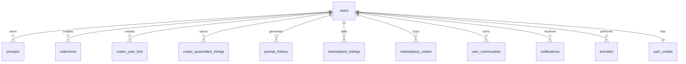
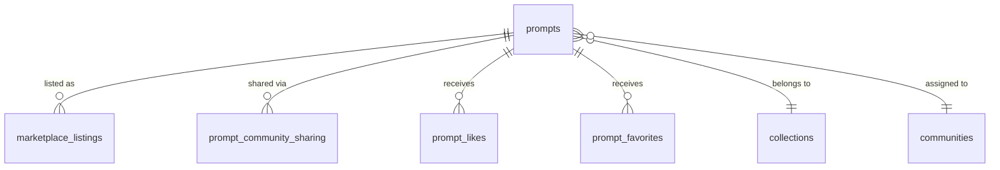
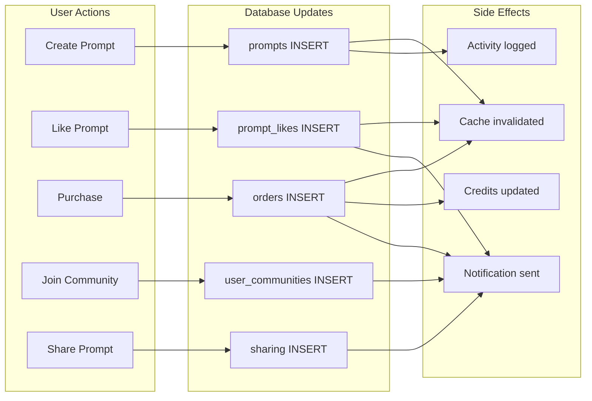

# PromptAtrium Feature Interaction Map

> **Purpose:** Visual map of how features connect and share data  
> **Use Case:** Quick reference for understanding cross-feature dependencies  
> **Created:** December 2024

---

## Feature Overview

```
┌─────────────────────────────────────────────────────────────────────────────┐
│                           PromptAtrium Platform                              │
├─────────────────────────────────────────────────────────────────────────────┤
│                                                                              │
│    ┌──────────────┐      ┌──────────────┐      ┌──────────────┐             │
│    │   WORDSMITH  │      │    PROMPT    │      │    PROMPT    │             │
│    │    CODEX     │─────▶│   GENERATOR  │─────▶│   DATABASE   │             │
│    │              │      │              │      │   (Library)  │             │
│    └──────────────┘      └──────────────┘      └──────────────┘             │
│           │                     │                     │                      │
│           │                     │                     │                      │
│           ▼                     ▼                     ▼                      │
│    ┌──────────────────────────────────────────────────────────┐             │
│    │                    SHARED SERVICES                        │             │
│    │  ┌─────────┐  ┌─────────┐  ┌─────────┐  ┌─────────┐      │             │
│    │  │  Auth   │  │Activity │  │ Notifs  │  │ Credits │      │             │
│    │  └─────────┘  └─────────┘  └─────────┘  └─────────┘      │             │
│    └──────────────────────────────────────────────────────────┘             │
│                                    │                                         │
│           ┌────────────────────────┼────────────────────────┐               │
│           ▼                        ▼                        ▼               │
│    ┌──────────────┐      ┌──────────────┐      ┌──────────────┐             │
│    │  MARKETPLACE │◀─────│   PROMPTS    │─────▶│  COMMUNITIES │             │
│    │              │      │   (shared)   │      │              │             │
│    └──────────────┘      └──────────────┘      └──────────────┘             │
│                                                                              │
└─────────────────────────────────────────────────────────────────────────────┘
```

---

## Primary Data Flow Paths

### Path 1: Content Creation Pipeline

```
Codex → Generator → Library
```

| Step | Source | Destination | Data Transferred |
|------|--------|-------------|------------------|
| 1 | Codex | Generator | Assembled terms (URL params) |
| 2 | Generator | OpenAI | Initial prompt for enhancement |
| 3 | OpenAI | Generator | Enhanced prompt text |
| 4 | Generator | Library | Complete prompt object |

**Tables involved:**
- `codex_assembled_strings` (optional save)
- `prompt_templates` (template used)
- `prompt_history` (generation logged)
- `prompts` (final save)

---

### Path 2: Monetization Pipeline

```
Library → Marketplace → Stripe → Seller
```

| Step | Source | Destination | Data Transferred |
|------|--------|-------------|------------------|
| 1 | Library | Marketplace | promptId, price, license |
| 2 | Marketplace | Stripe | PaymentIntent |
| 3 | Stripe | Webhook | payment_intent.succeeded |
| 4 | Webhook | Ledger | Transaction record |
| 5 | Ledger | Stripe | Transfer to seller |

**Tables involved:**
- `prompts` (source content)
- `marketplace_listings` (public listing)
- `marketplace_orders` (purchase record)
- `transaction_ledger` (financial record)
- `seller_profiles` (payout destination)

---

### Path 3: Social Distribution Pipeline

```
Library → Communities → Members
```

| Step | Source | Destination | Data Transferred |
|------|--------|-------------|------------------|
| 1 | Library | Sharing | promptId, communityId |
| 2 | Sharing | Notifications | New content alert |
| 3 | Notifications | Members | Push/in-app notification |
| 4 | Members | Library | View shared prompt |

**Tables involved:**
- `prompts` (shared content)
- `prompt_community_sharing` (share record)
- `communities` (target group)
- `notifications` (member alerts)

---

## Feature Dependency Matrix

```
             │ Codex │Generator│Library│Market│Community│ Auth │
─────────────┼───────┼─────────┼───────┼──────┼─────────┼──────┤
Codex        │   -   │  SENDS  │   ❌   │  ❌   │    ❌    │  ✅  │
Generator    │ READS │    -    │ SAVES │  ❌   │    ❌    │  ✅  │
Library      │   ❌   │ RECEIVES│   -   │LISTS │ SHARES  │  ✅  │
Marketplace  │   ❌   │    ❌    │ READS │  -   │    ❌    │  ✅  │
Communities  │   ❌   │    ❌    │ READS │  ❌   │    -    │  ✅  │
```

**Legend:**
- `SENDS` = Provides data to
- `READS` = Consumes data from
- `RECEIVES` = Gets data from
- `SAVES` = Persists to
- `LISTS` = Creates listings from
- `SHARES` = Distributes to
- `✅` = Requires this service
- `❌` = No direct dependency

---

## Shared Database Tables

### Core Entity: `users`

**Used by ALL features** - Central identity



### Core Entity: `prompts`

**Shared by Library, Marketplace, Communities**



---

## API Endpoint Ownership

### By Feature

| Feature | Endpoint Prefix | Key Endpoints |
|---------|-----------------|---------------|
| **Auth** | `/api/auth` | `/user`, `/google`, `/callback` |
| **Codex** | `/api/wordsmith-*`, `/api/codex-*` | `/categories`, `/terms`, `/assembled-strings` |
| **Generator** | `/api/prompt-*`, `/api/enhance-*`, `/api/character-*` | `/templates`, `/history`, `/refinement` |
| **Library** | `/api/prompts`, `/api/collections` | CRUD, `/like`, `/favorite`, `/branch` |
| **Marketplace** | `/api/marketplace` | `/listings`, `/orders`, `/checkout` |
| **Communities** | `/api/communities` | `/members`, `/invites`, `/sharing` |
| **Admin** | `/api/admin` | `/users`, `/stats`, `/settings` |

### Cross-Feature API Calls

| From | To | Purpose |
|------|-----|---------|
| Generator → Library | `POST /api/prompts` | Save generated prompt |
| Library → Marketplace | `POST /api/marketplace/listings` | Create listing |
| Library → Communities | `POST /api/prompt-community-sharing` | Share prompt |
| Marketplace → Notifications | Auto | Purchase alerts |
| Communities → Notifications | Auto | Share alerts |

---

## Event Flow Diagram



---

## Cache Coordination

### Query Key Namespaces

| Feature | Key Pattern | Example |
|---------|-------------|---------|
| Codex | `/api/wordsmith-*` | `['/api/wordsmith-categories']` |
| Codex | `/api/codex-*` | `['/api/codex-assembled-strings']` |
| Generator | `/api/prompt-templates` | `['/api/prompt-templates', {isGlobal}]` |
| Generator | `/api/character-presets` | `['/api/character-presets']` |
| Library | `/api/prompts` | `['/api/prompts', {userId, status}]` |
| Library | `/api/collections` | `['/api/collections']` |
| Marketplace | `/api/marketplace/*` | `['/api/marketplace/listings']` |
| Communities | `/api/communities` | `['/api/communities']` |

### Cross-Feature Invalidation

| Action | Primary | Also Invalidate |
|--------|---------|-----------------|
| Save prompt from Generator | `/api/prompts` | `/api/prompt-history`, `/api/user/stats` |
| Create listing | `/api/marketplace/listings` | `/api/prompts` (update status) |
| Complete purchase | `/api/marketplace/orders` | `/api/notifications`, `/api/user-credits` |
| Share to community | `/api/prompt-community-sharing` | `/api/communities/*/prompts` |

---

## Security Boundaries

```
┌─────────────────────────────────────────────────────────────────┐
│                        PUBLIC (No Auth)                          │
│  • View public prompts    • View public profiles                │
│  • Browse marketplace     • Search                              │
└─────────────────────────────────────────────────────────────────┘
                              │
                              ▼
┌─────────────────────────────────────────────────────────────────┐
│                     AUTHENTICATED (Session)                      │
│  • CRUD own prompts       • Like/favorite                       │
│  • Use generator          • Browse codex                        │
│  • Purchase from market   • Join communities                    │
└─────────────────────────────────────────────────────────────────┘
                              │
                              ▼
┌─────────────────────────────────────────────────────────────────┐
│                      SELLER (Verified)                           │
│  • Create listings        • View earnings                       │
│  • Manage payouts         • Access seller dashboard             │
└─────────────────────────────────────────────────────────────────┘
                              │
                              ▼
┌─────────────────────────────────────────────────────────────────┐
│                    COMMUNITY ADMIN (Role)                        │
│  • Manage members         • Approve content                     │
│  • Invite users           • Moderate discussions                │
└─────────────────────────────────────────────────────────────────┘
                              │
                              ▼
┌─────────────────────────────────────────────────────────────────┐
│                      SUPER ADMIN (Role)                          │
│  • User management        • System settings                     │
│  • View all data          • Process payouts                     │
│  • Feature flags          • Developer tools                     │
└─────────────────────────────────────────────────────────────────┘
```

---

## Quick Reference: "What Talks to What"

### Frontend Components

| Component | Calls API | Updates Cache | Triggers |
|-----------|-----------|---------------|----------|
| PromptCard | `/api/prompts/:id/like` | `prompts` | Toast |
| SaveDialog | `/api/prompts` POST | `prompts`, `user/stats` | Navigate |
| QuickPrompter | `/api/enhance-prompt` | — | Toast |
| MarketCheckout | `/api/marketplace/checkout/stripe` | `orders` | Redirect |
| CommunityPicker | `/api/prompt-community-sharing` | `notifications` | Toast |

### Backend Routes

| Route | Storage Method | Side Effects |
|-------|----------------|--------------|
| `POST /api/prompts` | `createPrompt()` | `createActivity()` |
| `POST /api/prompts/:id/like` | `togglePromptLike()` | `createNotification()` |
| `POST /api/marketplace/checkout/*` | `createOrder()` | Stripe webhook → `createNotification()` |
| `POST /api/prompt-community-sharing` | `sharePromptToCommunity()` | `createNotification()` for members |

---

## Summary

This interaction map shows:

1. **Three content pipelines**: Creation (Codex→Generator→Library), Monetization (Library→Marketplace), Distribution (Library→Communities)

2. **Central shared entities**: `users`, `prompts`, `notifications`, `activities`

3. **Clear feature boundaries**: Each feature owns specific tables and endpoints

4. **Predictable side effects**: Notifications and activities follow consistent patterns

Use this map alongside the detailed feature diagrams for complete architectural understanding.
