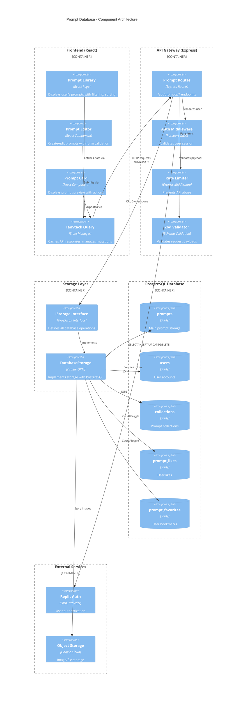
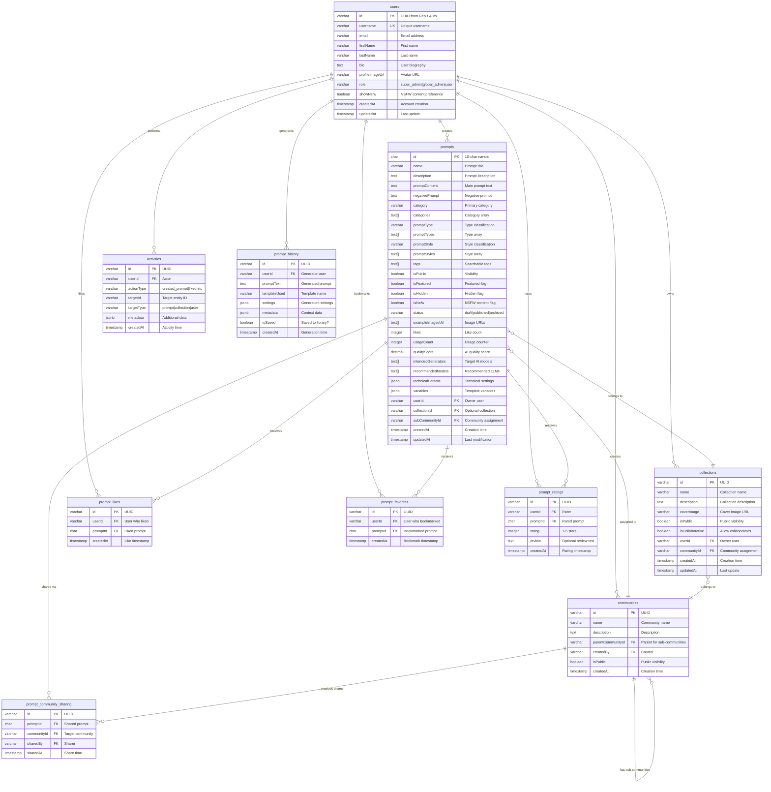

# PromptAtrium Prompt Database - Complete Diagram Set

> **Purpose:** Complete architectural diagrams for prompt database flow  
> **Created:** December 2024  
> **Contents:** C4 Component Diagram, Sequence Diagram, ER Diagram

---

## A. Architecture & Communication Map (C4 Component Diagram)

This C4 diagram shows how the Prompt Database feature communicates between components.

---

## B. State & Data Workflow (Sequence Diagram)

This sequence diagram shows the complete data workflow with state updates.

```mermaid
sequenceDiagram
    participant User as User
    participant UI as React UI
    participant Query as TanStack Query<br/>(Cache)
    participant API as Express API<br/>(/api/prompts)
    participant Auth as Auth Middleware<br/>(Passport)
    participant Storage as DatabaseStorage<br/>(Drizzle)
    participant DB as PostgreSQL

    Note over User,DB: === AUTHENTICATION FLOW ===
    User->>UI: Open app
    UI->>Query: Check auth state
    Query->>API: GET /api/auth/user
    API->>Auth: Validate session cookie
    Auth-->>API: User claims (sub, email)
    API->>Storage: getUser(userId)
    Storage->>DB: SELECT * FROM users WHERE id = ?
    DB-->>Storage: User record
    Storage-->>API: User object
    API-->>Query: 200 OK {user}
    Query->>Query: Cache user at ['/api/auth/user']
    Query-->>UI: User state updated
    UI-->>User: Show authenticated UI

    Note over User,DB: === FETCH PROMPTS (READ) ===
    User->>UI: Navigate to Library
    UI->>Query: useQuery(['/api/prompts'])
    Query->>Query: Check cache
    alt Cache HIT
        Query-->>UI: Return cached data
    else Cache MISS
        Query->>API: GET /api/prompts?userId=X&status=published
        API->>Auth: Validate session
        Auth-->>API: ✓ Authenticated
        API->>Storage: getPrompts(options)
        Storage->>DB: SELECT p.*, <br/>COUNT(pl.id) as likes,<br/>COUNT(pf.id) as favorites<br/>FROM prompts p<br/>LEFT JOIN prompt_likes pl...<br/>LEFT JOIN prompt_favorites pf...<br/>WHERE p.user_id = ?
        DB-->>Storage: Prompt rows with counts
        Storage-->>API: Prompt[] with relations
        API-->>Query: 200 OK [{prompt1}, {prompt2}...]
        Query->>Query: Cache at ['/api/prompts']
        Query-->>UI: Prompts array
    end
    UI-->>User: Display prompt grid

    Note over User,DB: === CREATE PROMPT ===
    User->>UI: Fill form & submit
    UI->>UI: Zod validate form
    UI->>Query: useMutation POST /api/prompts
    Query->>API: POST /api/prompts<br/>{name, promptContent, tags...}
    API->>Auth: Validate session
    Auth-->>API: ✓ Authenticated (userId)
    API->>API: Zod validate payload
    API->>Storage: createPrompt(data)
    Storage->>Storage: Generate ID (nanoid)
    Storage->>DB: INSERT INTO prompts<br/>(id, name, prompt_content...)
    DB->>DB: Set created_at, updated_at
    DB-->>Storage: Created prompt row
    Storage->>DB: INSERT INTO activities<br/>(user_id, action_type='created_prompt')
    DB-->>Storage: Activity created
    Storage-->>API: New prompt object
    API-->>Query: 201 Created {prompt}
    Query->>Query: Invalidate ['/api/prompts']
    Query->>Query: Invalidate ['/api/user/stats']
    Query-->>UI: Mutation success
    UI->>UI: Show success toast
    UI-->>User: Redirect to library

    Note over User,DB: === LIKE PROMPT ===
    User->>UI: Click heart icon
    UI->>Query: useMutation POST /api/prompts/:id/like
    Query->>API: POST /api/prompts/abc123/like
    API->>Auth: Validate session
    Auth-->>API: ✓ Authenticated (userId)
    API->>Storage: togglePromptLike(promptId, userId)
    Storage->>DB: SELECT * FROM prompt_likes<br/>WHERE prompt_id = ? AND user_id = ?
    alt Like EXISTS
        DB-->>Storage: Like record found
        Storage->>DB: DELETE FROM prompt_likes WHERE id = ?
        Storage->>DB: UPDATE prompts SET likes = likes - 1
        DB-->>Storage: Like removed
        Storage-->>API: {liked: false, likeCount: N}
    else Like NOT EXISTS
        DB-->>Storage: No record
        Storage->>DB: INSERT INTO prompt_likes<br/>(prompt_id, user_id)
        Storage->>DB: UPDATE prompts SET likes = likes + 1
        DB-->>Storage: Like created
        Storage-->>API: {liked: true, likeCount: N+1}
    end
    API-->>Query: 200 OK {liked, likeCount}
    Query->>Query: Update cache optimistically
    Query-->>UI: Toggle complete
    UI-->>User: Heart icon updated

    Note over User,DB: === UPDATE PROMPT ===
    User->>UI: Edit & save prompt
    UI->>Query: useMutation PUT /api/prompts/:id
    Query->>API: PUT /api/prompts/abc123<br/>{name, promptContent...}
    API->>Auth: Validate session
    Auth-->>API: ✓ Authenticated
    API->>Storage: getPrompt(id)
    Storage->>DB: SELECT * FROM prompts WHERE id = ?
    DB-->>Storage: Prompt record
    Storage-->>API: Prompt owner verified
    API->>API: Check userId === prompt.userId
    API->>Storage: updatePrompt(id, data)
    Storage->>DB: UPDATE prompts SET<br/>name = ?, prompt_content = ?,<br/>updated_at = NOW() WHERE id = ?
    DB-->>Storage: Updated row
    Storage-->>API: Updated prompt
    API-->>Query: 200 OK {prompt}
    Query->>Query: Invalidate ['/api/prompts']
    Query->>Query: Invalidate ['/api/prompts', id]
    Query-->>UI: Mutation success
    UI-->>User: Show update toast

    Note over User,DB: === DELETE PROMPT ===
    User->>UI: Confirm delete
    UI->>Query: useMutation DELETE /api/prompts/:id
    Query->>API: DELETE /api/prompts/abc123
    API->>Auth: Validate session
    Auth-->>API: ✓ Authenticated
    API->>Storage: getPrompt(id)
    Storage->>DB: SELECT user_id FROM prompts WHERE id = ?
    DB-->>Storage: Prompt owner
    API->>API: Verify ownership
    API->>Storage: deletePrompt(id)
    Storage->>DB: DELETE FROM prompt_likes WHERE prompt_id = ?
    Storage->>DB: DELETE FROM prompt_favorites WHERE prompt_id = ?
    Storage->>DB: DELETE FROM prompts WHERE id = ?
    DB-->>Storage: Deleted
    Storage-->>API: Success
    API-->>Query: 204 No Content
    Query->>Query: Invalidate ['/api/prompts']
    Query->>Query: Invalidate ['/api/user/stats']
    Query-->>UI: Deletion complete
    UI-->>User: Prompt removed from view
```

---

## C. Data Schema (Entity Relationship Diagram)

This ERD shows the database tables and relationships for the Prompt Database feature.

---

## Key Data Relationships

### Core Entities

| Entity | Primary Key | Description |
|--------|-------------|-------------|
| `users` | `id` (UUID) | Central entity - all content links to a user |
| `prompts` | `id` (10-char) | Main content entity |
| `collections` | `id` (UUID) | Grouping entity for prompts |

### Many-to-Many Relationships

| Relationship | Junction Table | Purpose |
|--------------|----------------|---------|
| User ↔ Prompt (likes) | `prompt_likes` | Track user likes |
| User ↔ Prompt (favorites) | `prompt_favorites` | Track user bookmarks |
| User ↔ Prompt (ratings) | `prompt_ratings` | Track user ratings |
| Prompt ↔ Community | `prompt_community_sharing` | Share prompts with communities |

### Foreign Key Constraints

| Table | Foreign Key | References | On Delete |
|-------|-------------|------------|-----------|
| `prompts` | `userId` | `users.id` | CASCADE |
| `prompts` | `collectionId` | `collections.id` | SET NULL |
| `prompt_likes` | `userId` | `users.id` | CASCADE |
| `prompt_likes` | `promptId` | `prompts.id` | CASCADE |
| `collections` | `userId` | `users.id` | CASCADE |

---

## Cache Invalidation Rules

| Action | Invalidate Keys |
|--------|-----------------|
| Create prompt | `['/api/prompts']`, `['/api/user/stats']` |
| Update prompt | `['/api/prompts']`, `['/api/prompts', id]` |
| Delete prompt | `['/api/prompts']`, `['/api/user/stats']` |
| Like/unlike | `['/api/prompts', id]` (optimistic) |
| Favorite/unfavorite | `['/api/prompts', id]`, `['/api/favorites']` |
| Add to collection | `['/api/prompts', id]`, `['/api/collections', collectionId]` |

---

This complete diagram set provides full visibility into the Prompt Database architecture for redesign planning.
