# PromptAtrium Prompt Generator Flow Architecture

> **Purpose:** Complete architectural analysis of the prompt generator flow (creation and enhancement)  
> **Created:** December 2024  
> **Scope:** Templates, character presets, AI enhancement, and prompt history

---

## Overview

The Prompt Generator (Quick Prompt Tool) is a sophisticated multi-step system that guides users through generating optimized AI prompts. It combines templates, character presets, AI enhancement, and smart caching to create high-quality prompts efficiently.

---

## Sequence Diagram: Complete Generator Flow

```mermaid
sequenceDiagram
    participant User as User
    participant App as React App<br/>(Quick Prompt)
    participant API as Express Backend<br/>(/api)
    participant LLM as AI LLM<br/>(OpenAI/Gemini)
    participant DB as PostgreSQL
    
    Note over User,DB: STEP 1: LOAD GENERATOR OPTIONS
    User->>App: Navigate to Quick Prompt Generator
    activate App
    App->>App: Fetch cached templates
    App->>API: GET /api/prompt-templates?isGlobal=true
    deactivate App
    
    activate API
    API->>DB: SELECT * FROM promptTemplates<br/>WHERE isGlobal = true
    deactivate API
    
    activate DB
    DB-->>API: [{template1}, {template2}, ...]
    deactivate DB
    
    API-->>App: 200 OK - Templates
    
    activate App
    App->>API: GET /api/character-presets?isGlobal=true
    deactivate App
    
    activate API
    API->>DB: SELECT * FROM characterPresets<br/>WHERE isGlobal = true
    deactivate API
    
    activate DB
    DB-->>API: [{char1}, {char2}, ...]
    deactivate DB
    
    API-->>App: 200 OK - Characters
    App->>App: Store in TanStack Query cache
    App-->>User: Display template & character lists
    
    Note over User,DB: STEP 2: SELECT TEMPLATE
    User->>App: Click template "Cinematic Portrait"
    App->>App: Load template details
    App->>App: Display template fields
    App->>App: Show "Master Prompt" system instructions
    
    Note over User,DB: STEP 3: FILL GENERATOR FORM
    User->>App: Enter subject/details
    User->>App: Select character preset
    User->>App: Select tone/style options
    App->>App: Build initial prompt<br/>Template + Subject + Character
    App-->>User: Display generated prompt preview
    
    Note over User,DB: STEP 4: GENERATE INITIAL PROMPT
    User->>App: Click "Generate"
    activate App
    App->>App: Validate form (Zod schema)
    App->>API: POST /api/prompt-generator/generate<br/>{template, subject, character, tone, style}
    deactivate App
    
    activate API
    API->>API: Validate request schema
    API->>API: Build base prompt:<br/>template.template + subject + character
    API->>DB: SELECT template data<br/>WHERE templateId matches
    deactivate API
    
    activate DB
    DB-->>API: Template object with masterPrompt
    deactivate DB
    
    API-->>App: 200 OK<br/>{generatedPrompt, metadata}
    App->>App: Store in local state
    App-->>User: Display generated prompt
    
    Note over User,DB: STEP 5: ENHANCE WITH AI
    User->>App: Click "Enhance with AI"
    activate App
    App->>API: POST /api/enhance-prompt<br/>{prompt, llmProvider, llmModel, useHappyTalk, compressPrompt}
    deactivate App
    
    activate API
    API->>API: Build system prompt:<br/>template.masterPrompt + character context
    API->>API: Call LLM service<br/>(OpenAI or Gemini)
    deactivate API
    
    activate LLM
    LLM->>LLM: Process request:<br/>System: [master prompt]<br/>User: [generated prompt]
    LLM-->>API: Enhanced prompt text
    deactivate LLM
    
    activate API
    API->>API: Clean response (remove quotes, etc.)
    API->>API: Optionally compress prompt<br/>if compressionLevel set
    API-->>App: 200 OK<br/>{enhancedPrompt, diagnostics}
    deactivate API
    
    App->>App: Display enhanced prompt
    App-->>User: Show comparison
    
    Note over User,DB: STEP 6: REFINE WITH AI CHAT (OPTIONAL)
    User->>App: Click "Refine with AI"
    activate App
    App->>API: POST /api/prompt-refinement/chat<br/>{message, currentPrompt, conversationId}
    deactivate App
    
    activate API
    API->>DB: Load user preferences (memory)
    deactivate API
    
    activate DB
    DB-->>API: UserPromptMemory (styles, themes, etc.)
    deactivate DB
    
    activate API
    API->>API: Build system prompt with<br/>user memory context
    API->>LLM: Chat message + current prompt
    deactivate API
    
    activate LLM
    LLM-->>API: Refined prompt suggestion
    deactivate LLM
    
    activate API
    API->>DB: Save conversation & message
    API->>DB: Extract preferences from<br/>conversation to update memory
    deactivate API
    
    activate DB
    DB->>DB: INSERT into prompt_refinement_messages
    DB->>DB: UPSERT user_prompt_memory
    DB-->>API: Conversation saved
    deactivate DB
    
    API-->>App: 200 OK<br/>{response, conversationId}
    App-->>User: Display AI suggestion
    
    Note over User,DB: STEP 7: SAVE TO LIBRARY
    User->>App: Click "Save to Library"
    App->>App: Open save modal
    App->>App: Validate prompt name & details
    activate App
    App->>API: POST /api/prompts<br/>{name, promptContent, promptStyle, tags, isPublic, ...}
    deactivate App
    
    activate API
    API->>API: Extract userId from auth
    API->>API: Generate prompt ID
    API->>DB: INSERT INTO prompts
    deactivate API
    
    activate DB
    DB->>DB: Create new prompt record
    DB->>DB: Set status = "published"<br/>Set createdAt, updatedAt
    DB-->>API: Created prompt
    deactivate DB
    
    API-->>App: 200 OK<br/>{id, name, promptContent, ...}
    
    activate App
    App->>API: POST /api/prompt-history<br/>{promptText, isSaved: true}
    deactivate App
    
    activate API
    API->>DB: INSERT INTO promptHistory<br/>isSaved = true
    deactivate API
    
    activate DB
    DB-->>API: History entry created
    deactivate DB
    
    API-->>App: 200 OK
    
    App->>App: Invalidate caches:<br/>- ['/api/prompts']<br/>- ['/api/prompt-history']
    App->>App: Show success toast
    App-->>User: Prompt saved! Show library link
```



---

## Data Flow: Generator to Library

```
User Input (Form)
    ↓
Template Selection
    ↓
Character Preset Selection
    ↓
Initial Prompt Generation (Template Merge)
    ↓
AI Enhancement (LLM Call)
    ↓
Optional AI Refinement Chat
    ↓
Prompt History Entry (with isSaved: false)
    ↓
Save Decision
    ├─ YES: Create Prompt in Library
    │   ├─ Generate ID (nanoid)
    │   ├─ Save to prompts table
    │   ├─ Update PromptHistory (isSaved: true)
    │   └─ Invalidate caches
    │
    └─ NO: Keep in History (isSaved: false)
```

---

## Core Generator Data Objects

### 1. **PromptTemplate (Generator Template)**

**Database Table:** `prompt_templates`

**Purpose:** Reusable templates for prompt generation with predefined structure and AI instructions

| Field | Type | Required | Purpose |
|-------|------|----------|---------|
| `id` | UUID | ✅ | Template ID |
| `name` | string | ✅ | "Cinematic Portrait", "Product Description" |
| `description` | text | ❌ | What this template does |
| `template` | text | ✅ | **Base template string with placeholders** |
| `masterPrompt` | text | ✅ | **LLM system prompt for enhancement** |
| `templateType` | string | ❌ | "image", "text", etc. |
| `llmProvider` | string | | Default: "openai" |
| `llmModel` | string | | Default: "gpt-4o" |
| `useHappyTalk` | boolean | | Add friendly tone |
| `compressPrompt` | boolean | | Compress output |
| `compressionLevel` | string | | "light" \| "medium" \| "heavy" |
| `userId` | UUID | ❌ | Creator (for custom templates) |
| `isGlobal` | boolean | | Available to all users |
| `isDefault` | boolean | | Featured/recommended |
| `createdAt` | timestamp | | |
| `updatedAt` | timestamp | | |

**Example Template:**

```json
{
  "id": "tmpl-123",
  "name": "Cinematic Portrait",
  "template": "A cinematic portrait of {character} as a {subject}, {tone} lighting, {style} composition, professional photography, detailed, {additionalDetails}",
  "masterPrompt": "You are an expert prompt engineer. Transform this into a highly detailed cinematic prompt for image generation. Include camera angles, lighting setup, and artistic style. Keep it concise but impactful.",
  "llmProvider": "openai",
  "llmModel": "gpt-4o",
  "isGlobal": true
}
```

**Frontend Usage:**

```typescript
// Load templates
const { data: templates } = useQuery({
  queryKey: ['/api/prompt-templates', { isGlobal: true }],
  queryFn: () => apiRequest('/api/prompt-templates?isGlobal=true')
});

// Template merge
const initialPrompt = template.template
  .replace('{character}', selectedCharacter.name)
  .replace('{subject}', userInput.subject)
  .replace('{tone}', selectedTone);
```

---

### 2. **CharacterPreset (Generator Characters)**

**Database Table:** `character_presets`

**Purpose:** Predefined characters that can be used in prompt generation

| Field | Type | Required | Purpose |
|-------|------|----------|---------|
| `id` | UUID | ✅ | Preset ID |
| `name` | string | ✅ | "Cyberpunk Samurai", "Victorian Noble" |
| `gender` | string | ❌ | "male", "female", "neutral" |
| `role` | string | ❌ | "warrior", "noble", "artist" |
| `description` | text | ✅ | Full character description |
| `isFavorite` | boolean | | User's favorite flag |
| `userId` | UUID | ❌ | Creator (if custom) |
| `isGlobal` | boolean | | Available to all users |
| `createdAt` | timestamp | | |
| `updatedAt` | timestamp | | |

**Example Character:**

```json
{
  "id": "char-456",
  "name": "Cyberpunk Samurai",
  "gender": "male",
  "role": "warrior",
  "description": "A futuristic samurai warrior with neon-glowing katana, cybernetic enhancements, traditional Japanese clothing mixed with tech, intense expression, dark atmosphere",
  "isGlobal": true
}
```

---

### 3. **PromptHistory (Generation Memory)**

**Database Table:** `prompt_history`

**Purpose:** Track all prompts generated (saved and unsaved) for user's workflow

| Field | Type | Required | Purpose |
|-------|------|----------|---------|
| `id` | UUID | ✅ | History ID |
| `userId` | UUID | ✅ | Which user |
| `promptText` | text | ✅ | The generated prompt |
| `templateUsed` | string | ❌ | Which template was used |
| `settings` | jsonb | | {tone, style, llmProvider, ...} |
| `metadata` | jsonb | | {character, subject, ...} |
| `isSaved` | boolean | | Is this in the library? |
| `createdAt` | timestamp | | Generation time |

**Example Entry:**

```json
{
  "id": "hist-789",
  "userId": "user-123",
  "promptText": "A cinematic portrait of cyberpunk samurai...",
  "templateUsed": "Cinematic Portrait",
  "settings": {
    "tone": "dramatic",
    "style": "cinematic",
    "llmProvider": "openai",
    "useHappyTalk": false,
    "compressPrompt": true
  },
  "metadata": {
    "character": "Cyberpunk Samurai",
    "subject": "warrior in neon city",
    "additionalDetails": "ultra detailed, 8k resolution"
  },
  "isSaved": true,
  "createdAt": "2024-12-19T10:30:00Z"
}
```

---

### 4. **PromptStyleRuleTemplate**

**Database Table:** `prompt_stylerule_templates`

**Purpose:** Advanced templates with style rules and LLM configuration

| Field | Type | Purpose |
|-------|------|---------|
| `id` | UUID | Template ID |
| `name` | string | Style template name |
| `template` | text | Template string |
| `systemPrompt` | text | LLM instructions |
| `llmProvider` | string | "openai" or "google" |
| `llmModel` | string | Model version |
| `useHappyTalk` | boolean | Friendly tone flag |
| `compressPrompt` | boolean | Compression flag |
| `compressionLevel` | integer | 1-3 scale |
| `isDefault` | boolean | Featured template |
| `userId` | UUID | Creator |

---

### 5. **IntendedGenerator (Target Models)**

**Database Table:** `intended_generators`

**Purpose:** List of AI image generators the prompt is optimized for

| Field | Type | Purpose |
|-------|------|---------|
| `id` | UUID | Generator ID |
| `name` | string | "Midjourney", "DALL-E", "Stable Diffusion" |
| `description` | text | Generator details |
| `type` | string | "user" \| "global" |
| `isActive` | boolean | Is it in use? |

---

### 6. **RecommendedModel (AI Models)**

**Database Table:** `recommended_models`

**Purpose:** AI models the prompt is optimized for

| Field | Type | Purpose |
|-------|------|---------|
| `id` | UUID | Model ID |
| `name` | string | "gpt-4o", "Claude 3", "Gemini" |
| `description` | text | Model specs |
| `type` | string | "user" \| "global" |
| `isActive` | boolean | Is it in use? |

---

### 7. **UserPromptMemory (AI Learning)**

**Database Table:** `user_prompt_memory`

**Purpose:** Learn user preferences from refinement conversations

| Field | Type | Purpose |
|-------|------|---------|
| `userId` | UUID | Which user |
| `preferredStyles` | string[] | Styles they like |
| `preferredThemes` | string[] | Themes they prefer |
| `preferredModifiers` | string[] | Modifiers they use |
| `avoidedTerms` | string[] | Words to skip |
| `customInstructions` | text | Personal guidelines |
| `lastUpdated` | timestamp | Last memory update |

**Example:**

```json
{
  "userId": "user-123",
  "preferredStyles": ["cinematic", "dramatic lighting", "neon"],
  "preferredThemes": ["cyberpunk", "futuristic", "dystopian"],
  "preferredModifiers": ["ultra detailed", "8k resolution", "cinematic"],
  "avoidedTerms": ["cartoon", "anime", "simple"],
  "customInstructions": "Always include moody lighting and dark color palette"
}
```

---

### 8. **PromptRefinementConversation (Chat History)**

**Database Table:** `prompt_refinement_conversations`

**Purpose:** Track refinement chat sessions

| Field | Type | Purpose |
|-------|------|---------|
| `id` | UUID | Conversation ID |
| `userId` | UUID | Participant |
| `currentPrompt` | text | Prompt being refined |
| `title` | string | Conversation title |
| `isActive` | boolean | Ongoing? |
| `messageCount` | integer | Messages exchanged |
| `createdAt` | timestamp | Start time |
| `updatedAt` | timestamp | Last message |

---

### 9. **PromptRefinementMessage (Chat Messages)**

**Database Table:** `prompt_refinement_messages`

**Purpose:** Individual chat messages in refinement

| Field | Type | Purpose |
|-------|------|---------|
| `id` | UUID | Message ID |
| `conversationId` | UUID | Which conversation |
| `role` | string | "user" \| "assistant" |
| `content` | text | Message content |
| `createdAt` | timestamp | When sent |

---

## API Endpoints: Generator Flow

### Template Operations

| Method | Endpoint | Purpose |
|--------|----------|---------|
| `GET` | `/api/prompt-templates` | List all templates |
| `GET` | `/api/prompt-templates/:id` | Get template details |
| `POST` | `/api/prompt-templates` | Create custom template |
| `PATCH` | `/api/prompt-templates/:id` | Update template |
| `DELETE` | `/api/prompt-templates/:id` | Delete template |

### Character Operations

| Method | Endpoint | Purpose |
|--------|----------|---------|
| `GET` | `/api/character-presets` | List characters |
| `GET` | `/api/character-presets/:id` | Get character |
| `POST` | `/api/character-presets` | Create custom character |
| `PATCH` | `/api/character-presets/:id` | Update character |
| `DELETE` | `/api/character-presets/:id` | Delete character |

### Generation Operations

| Method | Endpoint | Purpose |
|--------|----------|---------|
| `POST` | `/api/prompt-generator/generate` | Generate prompt from template |
| `POST` | `/api/enhance-prompt` | AI enhance single prompt |
| `POST` | `/api/enhance-prompt/batch` | AI enhance multiple |
| `POST` | `/api/prompt-history` | Save to history |
| `GET` | `/api/prompt-history` | Get user's history |
| `DELETE` | `/api/prompt-history/:id` | Delete history entry |

### Refinement Operations

| Method | Endpoint | Purpose |
|--------|----------|---------|
| `POST` | `/api/prompt-refinement/chat` | Send chat message |
| `GET` | `/api/prompt-refinement/conversations` | List conversations |
| `GET` | `/api/prompt-refinement/conversations/:id` | Get conversation |
| `DELETE` | `/api/prompt-refinement/conversations/:id` | Delete conversation |
| `GET` | `/api/prompt-refinement/memory` | Get user memory |
| `PATCH` | `/api/prompt-refinement/memory` | Update memory |

---

## Request/Response Flow Examples

### Generate from Template

**Frontend Request:**

```typescript
POST /api/prompt-generator/generate
{
  templateId: "tmpl-123",
  subject: "warrior in neon city",
  characterId: "char-456",
  tone: "dramatic",
  style: "cinematic",
  additionalDetails: "8k resolution, ultra detailed"
}
```

**Backend Response:**

```json
{
  "generatedPrompt": "A cinematic portrait of cyberpunk samurai as a warrior in neon city, dramatic lighting, cinematic composition, professional photography, detailed, 8k resolution, ultra detailed",
  "metadata": {
    "templateUsed": "Cinematic Portrait",
    "character": "Cyberpunk Samurai",
    "subject": "warrior in neon city"
  }
}
```

### Enhance with AI

**Frontend Request:**

```typescript
POST /api/enhance-prompt
{
  prompt: "A portrait of a warrior...",
  llmProvider: "openai",
  llmModel: "gpt-4o",
  useHappyTalk: false,
  compressPrompt: true,
  compressionLevel: "medium",
  templateId: "tmpl-123"
}
```

**Backend Process:**

1. Get template's `masterPrompt` system instruction
2. Call OpenAI with:
   - **System:** `masterPrompt` content
   - **User:** The user's prompt
3. Get response from LLM
4. Clean response (remove quotes, etc.)
5. Compress if requested
6. Return enhanced prompt

**Response:**

```json
{
  "enhancedPrompt": "Cinematic portrait of a cyberpunk samurai warrior, neon-lit alleyway background, glowing katana, cybernetic enhancements visible, intense dramatic lighting from above, film noir color grading...",
  "diagnostics": {
    "originalLength": 120,
    "enhancedLength": 245,
    "llmProvider": "openai",
    "llmModel": "gpt-4o",
    "processingTime": 1234
  }
}
```

### Refine with Chat

**Frontend Request:**

```typescript
POST /api/prompt-refinement/chat
{
  message: "Make it more detailed with specific camera angles",
  currentPrompt: "A cinematic portrait of...",
  conversationId: "conv-789" // undefined if new
}
```

**Backend Process:**

1. Get user's `UserPromptMemory`
2. Build system prompt with:
   - Base instructions
   - User's preferred styles
   - User's avoided terms
   - Current prompt context
3. Send to OpenAI
4. Save message to database
5. Extract preferences from conversation
6. Update `UserPromptMemory`

**Response:**

```json
{
  "response": "Here's a more detailed version with camera specifications: [enhanced prompt]",
  "conversationId": "conv-789",
  "updatedMemory": {
    "preferredModifiers": ["cinematic", "dramatic lighting", "specific camera angles"]
  }
}
```

---

## Cache Strategy

**TanStack Query Keys:**

```typescript
['/api/prompt-templates']           // All templates
['/api/prompt-templates', { isGlobal: true }]  // Global templates
['/api/character-presets']          // All characters
['/api/prompt-history']             // User's history
['/api/prompt-refinement/conversations']  // Refinement chats
```

**Invalidation Triggers:**

```typescript
// Template changes
queryClient.invalidateQueries({
  queryKey: ['/api/prompt-templates']
});

// Character changes
queryClient.invalidateQueries({
  queryKey: ['/api/character-presets']
});

// History changes
queryClient.invalidateQueries({
  queryKey: ['/api/prompt-history']
});

// After saving to library
queryClient.invalidateQueries({
  queryKey: ['/api/prompts']  // Library updated
});
queryClient.invalidateQueries({
  queryKey: ['/api/prompt-history']  // History updated
});
```

---

## Critical Data Consistency Rules

### Template Structure

- **Always has:** `template`, `masterPrompt`, `name`
- **Placeholders:** {character}, {subject}, {tone}, {style}, {additionalDetails}
- **masterPrompt:** Must be suitable for OpenAI/Gemini system role

### Character Insertion

- **Direct string replacement:** Template {character} → Character.name
- **Context addition:** masterPrompt includes character.description
- **Safety:** No HTML/injection in character names

### Prompt Generation Flow

```
Template String (with placeholders)
  ↓ Replace {character} ← CharacterPreset.name
  ↓ Replace {subject} ← User input
  ↓ Replace {tone} ← User selection
  ↓ Replace {style} ← User selection
  ↓ Replace {additionalDetails} ← User input
  ↓
Initial Prompt (ready for LLM)
  ↓
LLM Enhancement
  ↓ System: masterPrompt + character context
  ↓ User: initial prompt
  ↓
Enhanced Prompt (final)
```

### Optional Refinement Chat

- Load UserPromptMemory (AI learns preferences)
- Send message to LLM with system prompt (includes memory)
- Parse response for preferences
- Update UserPromptMemory
- Continue conversation

---

## Design Considerations for Redesign

### What NOT to Change

- ❌ Template placeholder format ({character}, etc.)
- ❌ masterPrompt system role
- ❌ LLM provider integration points

### Safe to Change

- ✅ UI/template selection interface
- ✅ Form field organization
- ✅ Character display/filtering
- ✅ Result display/comparison
- ✅ Metadata captured (but preserve core fields)

### Performance Considerations

**Cached at startup:**
- Global templates (~10-50 records)
- Global characters (~20-100 records)
- IntendedGenerators (~10 records)

**Not cached (fetch on demand):**
- User's custom templates
- User's refinement conversations
- User's prompt history (paginated)

---

This architecture ensures that the prompt generator remains consistent and predictable during any redesign work.
