# PromptAtrium Prompt Generator - Complete Diagram Set

> **Purpose:** Complete architectural diagrams for prompt generator flow  
> **Created:** December 2024  
> **Contents:** C4 Component Diagram, Sequence Diagram, ER Diagram

---

## A. Architecture & Communication Map (C4 Component Diagram)

This C4 diagram shows how the Prompt Generator feature communicates between components.

```mermaid
C4Component
    title Prompt Generator - Component Architecture

    Container_Boundary(frontend, "Frontend (React)") {
        Component(quickPrompt, "Quick Prompt Page", "React Page", "Main generator interface")
        Component(templateSelector, "Template Selector", "React Component", "Browse/select templates")
        Component(characterPicker, "Character Picker", "React Component", "Select character presets")
        Component(generatorForm, "Generator Form", "React Component", "Input subject, tone, style")
        Component(resultPanel, "Result Panel", "React Component", "Display generated/enhanced prompt")
        Component(refinementChat, "Refinement Chat", "React Component", "AI-powered iterative improvement")
        Component(queryClient, "TanStack Query", "State Manager", "Caches templates, characters, history")
    }

    Container_Boundary(api, "API Gateway (Express)") {
        Component(templateRoutes, "Template Routes", "Express Router", "/api/prompt-templates/*")
        Component(characterRoutes, "Character Routes", "Express Router", "/api/character-presets/*")
        Component(enhanceRoute, "Enhance Route", "Express Router", "/api/enhance-prompt")
        Component(refinementRoutes, "Refinement Routes", "Express Router", "/api/prompt-refinement/*")
        Component(historyRoutes, "History Routes", "Express Router", "/api/prompt-history/*")
        Component(authMiddleware, "Auth Middleware", "Passport OIDC", "Validates user session")
    }

    Container_Boundary(storage, "Storage Layer") {
        Component(storageInterface, "IStorage Interface", "TypeScript Interface", "Database operations")
        Component(dbStorage, "DatabaseStorage", "Drizzle ORM", "PostgreSQL implementation")
    }

    Container_Boundary(database, "PostgreSQL Database") {
        ComponentDb(templatesTable, "prompt_templates", "Table", "Generator templates")
        ComponentDb(charactersTable, "character_presets", "Table", "Character definitions")
        ComponentDb(historyTable, "prompt_history", "Table", "Generation memory")
        ComponentDb(conversationsTable, "prompt_refinement_conversations", "Table", "Chat sessions")
        ComponentDb(messagesTable, "prompt_refinement_messages", "Table", "Chat messages")
        ComponentDb(memoryTable, "user_prompt_memory", "Table", "Learned preferences")
    }

    Container_Boundary(ai, "AI Services") {
        Component(openaiClient, "OpenAI Client", "OpenAI SDK", "GPT-4o enhancement")
        Component(geminiClient, "Gemini Client", "Google AI SDK", "Alternative LLM")
    }

    Rel(quickPrompt, templateSelector, "Uses")
    Rel(quickPrompt, characterPicker, "Uses")
    Rel(quickPrompt, generatorForm, "Uses")
    Rel(quickPrompt, resultPanel, "Uses")
    Rel(quickPrompt, refinementChat, "Uses")
    
    Rel(templateSelector, queryClient, "Fetches via")
    Rel(characterPicker, queryClient, "Fetches via")
    Rel(generatorForm, queryClient, "Submits via")
    Rel(refinementChat, queryClient, "Chats via")
    
    Rel(queryClient, templateRoutes, "HTTP GET", "JSON")
    Rel(queryClient, characterRoutes, "HTTP GET", "JSON")
    Rel(queryClient, enhanceRoute, "HTTP POST", "JSON")
    Rel(queryClient, refinementRoutes, "HTTP POST", "JSON")
    Rel(queryClient, historyRoutes, "HTTP POST/GET", "JSON")
    
    Rel(templateRoutes, authMiddleware, "Auth")
    Rel(enhanceRoute, authMiddleware, "Auth")
    Rel(refinementRoutes, authMiddleware, "Auth")
    
    Rel(templateRoutes, storageInterface, "CRUD")
    Rel(characterRoutes, storageInterface, "CRUD")
    Rel(historyRoutes, storageInterface, "CRUD")
    Rel(refinementRoutes, storageInterface, "CRUD")
    
    Rel(enhanceRoute, openaiClient, "Enhancement request")
    Rel(enhanceRoute, geminiClient, "Alternative LLM")
    Rel(refinementRoutes, openaiClient, "Chat completion")
    
    Rel(storageInterface, dbStorage, "Implements")
    Rel(dbStorage, templatesTable, "Query")
    Rel(dbStorage, charactersTable, "Query")
    Rel(dbStorage, historyTable, "Query")
    Rel(dbStorage, conversationsTable, "Query")
    Rel(dbStorage, messagesTable, "Query")
    Rel(dbStorage, memoryTable, "Query")

    UpdateLayoutConfig($c4ShapeInRow="3", $c4BoundaryInRow="2")
```



---

## B. State & Data Workflow (Sequence Diagram)

This sequence diagram shows the complete generator workflow with state updates.

```mermaid
sequenceDiagram
    participant User as User
    participant UI as Generator UI
    participant State as Local State<br/>(React useState)
    participant Query as TanStack Query<br/>(Cache)
    participant API as Express API
    participant Storage as DatabaseStorage
    participant LLM as OpenAI/Gemini
    participant DB as PostgreSQL

    Note over User,DB: === LOAD GENERATOR ===
    User->>UI: Open Quick Prompt page
    UI->>Query: useQuery(['/api/prompt-templates'])
    Query->>API: GET /api/prompt-templates?isGlobal=true
    API->>Storage: getPromptTemplates({isGlobal: true})
    Storage->>DB: SELECT * FROM prompt_templates<br/>WHERE is_global = true
    DB-->>Storage: Template rows
    Storage-->>API: PromptTemplate[]
    API-->>Query: 200 OK [{templates}]
    Query->>Query: Cache at ['/api/prompt-templates']
    Query-->>UI: Templates loaded

    par Load Characters
        UI->>Query: useQuery(['/api/character-presets'])
        Query->>API: GET /api/character-presets?isGlobal=true
        API->>Storage: getCharacterPresets({isGlobal: true})
        Storage->>DB: SELECT * FROM character_presets<br/>WHERE is_global = true
        DB-->>Storage: Character rows
        Storage-->>API: CharacterPreset[]
        API-->>Query: 200 OK [{characters}]
        Query->>Query: Cache at ['/api/character-presets']
        Query-->>UI: Characters loaded
    end

    UI-->>User: Display template & character selectors

    Note over User,DB: === SELECT TEMPLATE ===
    User->>UI: Click "Cinematic Portrait" template
    UI->>State: setSelectedTemplate(template)
    State-->>UI: Template selected
    UI-->>User: Show template fields<br/>(subject, tone, style, details)

    Note over User,DB: === SELECT CHARACTER ===
    User->>UI: Click "Cyberpunk Samurai" character
    UI->>State: setSelectedCharacter(character)
    State-->>UI: Character selected
    UI-->>User: Character badge shown

    Note over User,DB: === FILL FORM ===
    User->>UI: Enter subject, select tone/style
    UI->>State: setFormData({subject, tone, style})
    State-->>UI: Form updated
    UI->>UI: Live preview generation
    UI->>State: Generate initial prompt<br/>template.replace({character}, {subject})
    State-->>UI: Preview updated
    UI-->>User: Show initial prompt preview

    Note over User,DB: === GENERATE (CLIENT-SIDE) ===
    User->>UI: Click "Generate"
    UI->>UI: Validate form (Zod)
    UI->>State: Build prompt from template
    Note right of UI: initialPrompt = template.template<br/>.replace('{character}', char.name)<br/>.replace('{subject}', subject)<br/>.replace('{tone}', tone)<br/>.replace('{style}', style)
    State->>State: Store generatedPrompt
    UI-->>User: Display generated prompt

    Note over User,DB: === ENHANCE WITH AI ===
    User->>UI: Click "Enhance with AI"
    UI->>State: Set isEnhancing = true
    State-->>UI: Show loading spinner
    UI->>Query: useMutation POST /api/enhance-prompt
    Query->>API: POST /api/enhance-prompt<br/>{prompt, llmProvider, llmModel, templateId}
    API->>Storage: getPromptTemplate(templateId)
    Storage->>DB: SELECT master_prompt FROM prompt_templates
    DB-->>Storage: Template with masterPrompt
    Storage-->>API: Template object
    API->>API: Build system prompt<br/>(masterPrompt + character context)
    API->>LLM: chat.completions.create<br/>system: masterPrompt<br/>user: initialPrompt
    LLM->>LLM: Process enhancement
    LLM-->>API: Enhanced prompt text
    API->>API: Clean response<br/>(remove quotes, formatting)
    API->>API: Compress if enabled<br/>(light/medium/heavy)
    API-->>Query: 200 OK {enhancedPrompt, diagnostics}
    Query-->>UI: Enhancement complete
    UI->>State: setEnhancedPrompt(result)
    State-->>UI: Enhanced prompt stored
    UI-->>User: Display enhanced prompt

    Note over User,DB: === REFINE WITH AI CHAT ===
    User->>UI: Click "Refine" → Opens chat
    UI->>Query: useQuery(['/api/prompt-refinement/memory'])
    Query->>API: GET /api/prompt-refinement/memory
    API->>Storage: getUserPromptMemory(userId)
    Storage->>DB: SELECT * FROM user_prompt_memory<br/>WHERE user_id = ?
    DB-->>Storage: Memory or null
    Storage-->>API: UserPromptMemory | null
    API-->>Query: 200 OK {preferredStyles, avoidedTerms...}
    Query-->>UI: User memory loaded

    User->>UI: Type "Add more neon details"
    UI->>Query: useMutation POST /api/prompt-refinement/chat
    Query->>API: POST /api/prompt-refinement/chat<br/>{message, currentPrompt, conversationId}
    API->>Storage: Get or create conversation
    Storage->>DB: INSERT or SELECT conversation
    DB-->>Storage: Conversation record
    API->>Storage: getUserPromptMemory(userId)
    Storage->>DB: SELECT FROM user_prompt_memory
    DB-->>Storage: User preferences
    API->>API: Build system prompt with memory
    API->>LLM: chat.completions.create<br/>system: (with user preferences)<br/>user: message + currentPrompt
    LLM-->>API: Refined suggestion
    API->>Storage: createRefinementMessage<br/>{role: 'user', content: message}
    Storage->>DB: INSERT INTO prompt_refinement_messages
    API->>Storage: createRefinementMessage<br/>{role: 'assistant', content: response}
    Storage->>DB: INSERT INTO prompt_refinement_messages
    API->>API: Extract preferences from conversation
    API->>Storage: updateUserPromptMemory<br/>{preferredStyles: [...new]}
    Storage->>DB: UPSERT user_prompt_memory
    DB-->>Storage: Memory updated
    API-->>Query: 200 OK {response, conversationId}
    Query->>Query: Invalidate ['/api/prompt-refinement/memory']
    Query-->>UI: Refinement complete
    UI->>State: Append message to chat
    UI-->>User: Display AI suggestion

    Note over User,DB: === SAVE TO LIBRARY ===
    User->>UI: Click "Save to Library"
    UI->>UI: Open save modal
    User->>UI: Enter name, tags, visibility
    UI->>Query: useMutation POST /api/prompts
    Query->>API: POST /api/prompts<br/>{name, promptContent, tags, isPublic...}
    API->>Storage: createPrompt(data)
    Storage->>DB: INSERT INTO prompts
    DB-->>Storage: New prompt
    Storage-->>API: Created prompt
    API-->>Query: 201 Created {prompt}
    Query->>Query: Invalidate ['/api/prompts']

    UI->>Query: useMutation POST /api/prompt-history
    Query->>API: POST /api/prompt-history<br/>{promptText, templateUsed, isSaved: true}
    API->>Storage: savePromptToHistory(data)
    Storage->>DB: INSERT INTO prompt_history
    DB-->>Storage: History entry
    Storage-->>API: PromptHistory
    API-->>Query: 200 OK
    Query->>Query: Invalidate ['/api/prompt-history']
    Query-->>UI: Save complete
    UI-->>User: "Prompt saved!" toast
```



---

## C. Data Schema (Entity Relationship Diagram)

This ERD shows the database tables and relationships for the Prompt Generator feature.

```mermaid
erDiagram
    users {
        varchar id PK "UUID from Replit Auth"
        varchar username "Unique username"
        varchar email "Email address"
        boolean showNsfw "NSFW preference"
        timestamp createdAt "Account creation"
    }

    prompt_templates {
        varchar id PK "UUID"
        varchar templateId "Legacy ID"
        varchar name "Template name"
        text description "What this template does"
        text template "Template string with {placeholders}"
        text masterPrompt "LLM system prompt for enhancement"
        varchar templateType "image|text|description"
        varchar llmProvider "openai|google"
        varchar llmModel "gpt-4o|gemini-pro"
        boolean useHappyTalk "Friendly tone modifier"
        boolean compressPrompt "Enable compression"
        varchar compressionLevel "light|medium|heavy"
        varchar userId FK "Creator (if custom)"
        boolean isGlobal "Available to all users"
        boolean isDefault "Featured/recommended"
        timestamp createdAt "Creation time"
        timestamp updatedAt "Last update"
    }

    character_presets {
        varchar id PK "UUID"
        varchar name "Character name (replaces {character})"
        varchar gender "male|female|neutral"
        varchar role "warrior|noble|artist|etc"
        text description "Full character description"
        boolean isFavorite "User favorite flag"
        varchar userId FK "Creator (if custom)"
        boolean isGlobal "Available to all"
        timestamp createdAt "Creation time"
        timestamp updatedAt "Last update"
    }

    prompt_history {
        varchar id PK "UUID"
        varchar userId FK "Generator user"
        text promptText "Generated prompt text"
        varchar templateUsed "Template name used"
        jsonb settings "tone, style, llmProvider, etc"
        jsonb metadata "character, subject, details"
        boolean isSaved "Saved to library?"
        timestamp createdAt "Generation timestamp"
    }

    prompt_refinement_conversations {
        varchar id PK "UUID"
        varchar userId FK "Chat owner"
        text currentPrompt "Prompt being refined"
        varchar title "Conversation title"
        boolean isActive "Ongoing conversation"
        integer messageCount "Messages exchanged"
        timestamp createdAt "Start time"
        timestamp updatedAt "Last message time"
    }

    prompt_refinement_messages {
        varchar id PK "UUID"
        varchar conversationId FK "Parent conversation"
        varchar role "user|assistant"
        text content "Message content"
        timestamp createdAt "Message time"
    }

    user_prompt_memory {
        varchar id PK "UUID"
        varchar userId FK UK "One per user"
        text[] preferredStyles "Learned style preferences"
        text[] preferredThemes "Learned theme preferences"
        text[] preferredModifiers "Learned modifiers"
        text[] avoidedTerms "Terms to exclude"
        text customInstructions "User-defined guidelines"
        timestamp lastUpdated "Last memory update"
    }

    intended_generators {
        varchar id PK "UUID"
        varchar name UK "Midjourney|DALL-E|StableDiffusion"
        text description "Generator capabilities"
        varchar userId FK "Creator (if custom)"
        varchar type "user|global"
        boolean isActive "Currently available"
        timestamp createdAt "Creation time"
    }

    recommended_models {
        varchar id PK "UUID"
        varchar name UK "gpt-4o|claude-3|gemini-pro"
        text description "Model specifications"
        varchar userId FK "Creator (if custom)"
        varchar type "user|global"
        boolean isActive "Currently available"
        timestamp createdAt "Creation time"
    }

    prompts {
        char id PK "10-char nanoid"
        varchar name "Prompt title"
        text promptContent "Final prompt text"
        varchar userId FK "Owner"
        timestamp createdAt "Creation time"
    }

    %% Relationships
    users ||--o{ prompt_templates : "creates custom"
    users ||--o{ character_presets : "creates custom"
    users ||--o{ prompt_history : "generates"
    users ||--o{ prompt_refinement_conversations : "has"
    users ||--|| user_prompt_memory : "has one"
    users ||--o{ intended_generators : "creates custom"
    users ||--o{ recommended_models : "creates custom"
    users ||--o{ prompts : "saves to library"

    prompt_refinement_conversations ||--o{ prompt_refinement_messages : "contains"

    prompt_templates ||--o{ prompt_history : "used in"
    character_presets ||--o{ prompt_history : "used in"
```

---

## Key Data Relationships

### Core Entities

| Entity | Primary Key | Description |
|--------|-------------|-------------|
| `prompt_templates` | `id` (UUID) | Reusable templates with placeholders |
| `character_presets` | `id` (UUID) | Character definitions |
| `prompt_history` | `id` (UUID) | Generation memory |
| `user_prompt_memory` | `userId` (unique) | AI-learned preferences |

### Template Placeholder Contract

| Placeholder | Replaced By | Required |
|-------------|-------------|----------|
| `{character}` | CharacterPreset.name | ❌ Optional |
| `{subject}` | User input | ✅ Required |
| `{tone}` | Selected option | ❌ Optional |
| `{style}` | Selected option | ❌ Optional |
| `{additionalDetails}` | User input | ❌ Optional |

### AI Enhancement Flow

```
Template.template (with placeholders)
    ↓ Replace placeholders
Initial Prompt
    ↓ Send to LLM with Template.masterPrompt
Enhanced Prompt
    ↓ Optional compression
Final Prompt
    ↓ Save to prompt_history (isSaved: false)
    ↓ User clicks "Save to Library"
    ↓ Create in prompts table
    ↓ Update prompt_history (isSaved: true)
```

### Refinement Chat Flow

```
User sends message
    ↓ Load user_prompt_memory
    ↓ Build system prompt with preferences
    ↓ LLM generates response
    ↓ Save to prompt_refinement_messages
    ↓ Extract new preferences
    ↓ Update user_prompt_memory
```

---

## Cache Invalidation Rules

| Action | Invalidate Keys |
|--------|-----------------|
| Load templates | `['/api/prompt-templates']` (cache 5 min) |
| Load characters | `['/api/character-presets']` (cache 5 min) |
| Create custom template | `['/api/prompt-templates']` |
| Create custom character | `['/api/character-presets']` |
| Enhance prompt | No cache (real-time) |
| Save to history | `['/api/prompt-history']` |
| Save to library | `['/api/prompts']`, `['/api/prompt-history']` |
| Refinement chat | `['/api/prompt-refinement/memory']` |

---

## LLM Integration Points

| Endpoint | LLM Provider | Purpose |
|----------|--------------|---------|
| `/api/enhance-prompt` | OpenAI (GPT-4o) | Template-based enhancement |
| `/api/enhance-prompt` | Google (Gemini) | Alternative provider |
| `/api/prompt-refinement/chat` | OpenAI (GPT-4o) | Iterative refinement |

### System Prompt Structure

```
Base: Template.masterPrompt
+ Character context: "Replace generic references with {character.name}"
+ User memory: preferredStyles, avoidedTerms
+ Output instruction: "Provide ONLY the enhanced prompt, no explanations"
```

---

This complete diagram set provides full visibility into the Prompt Generator architecture for redesign planning.
