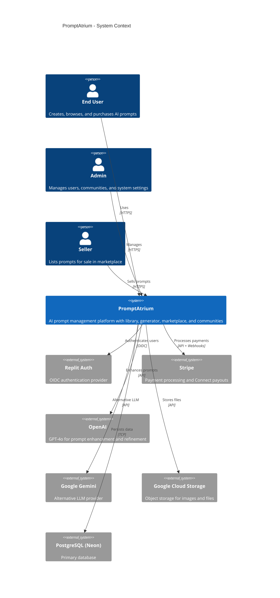
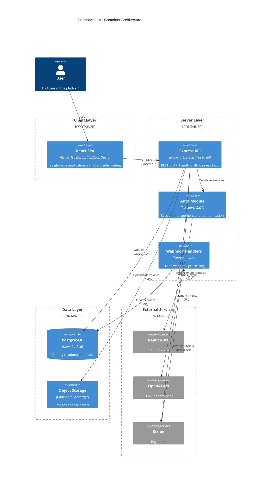
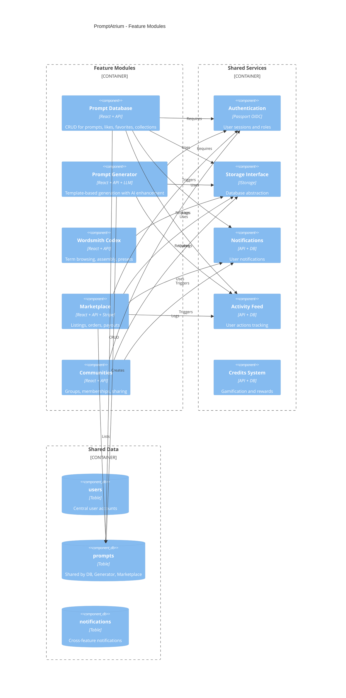
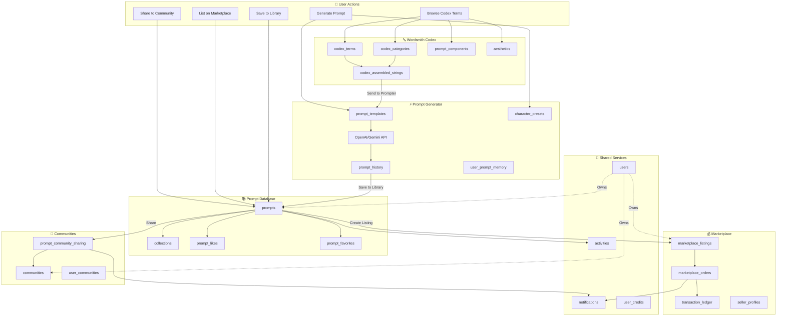
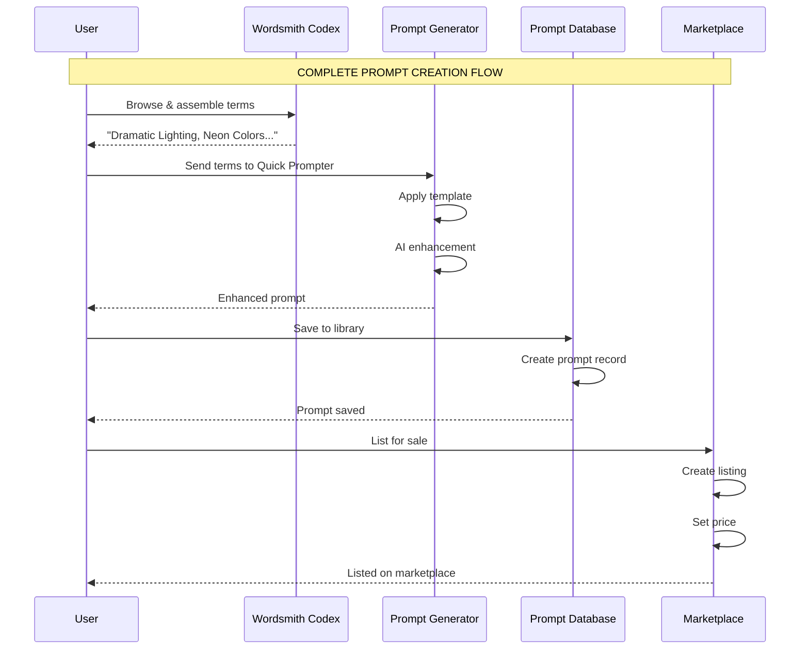
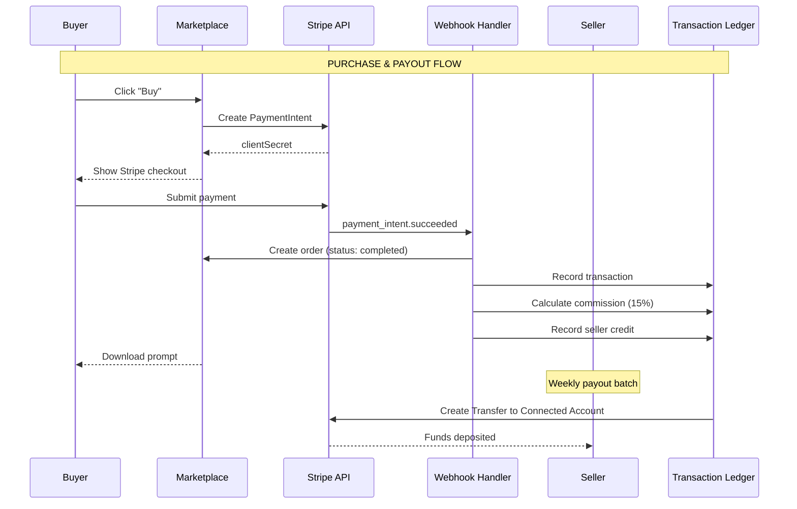
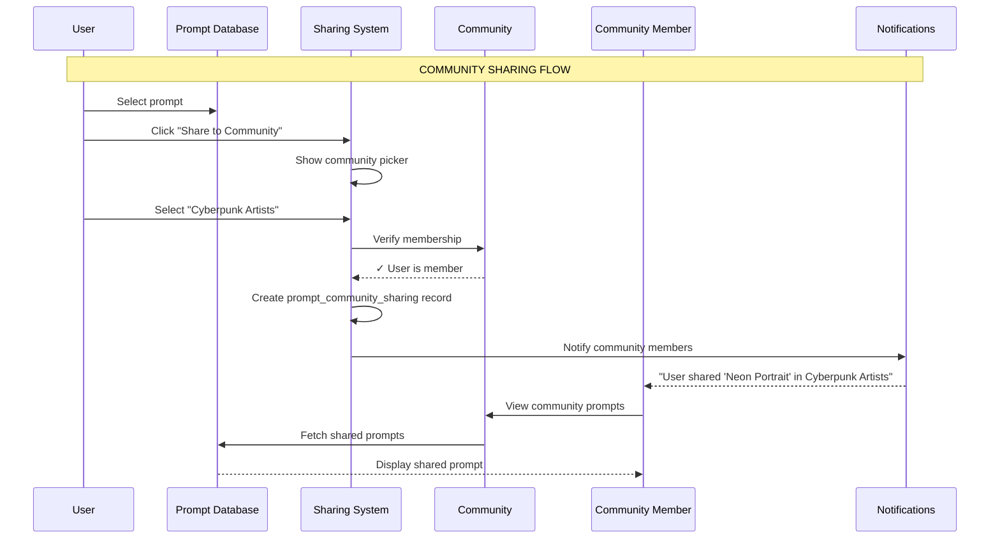
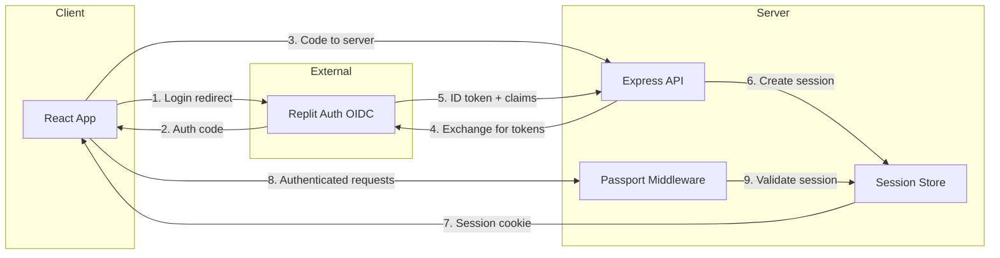

# PromptAtrium System Overview

> **Purpose:** Complete system-level architecture for understanding how all features interact  
> **Audience:** Developers, architects, designers planning redesigns  
> **Created:** December 2024  
> **Last Updated:** December 2024

---

## Executive Summary

PromptAtrium is a comprehensive AI prompt management platform with five major subsystems:

1. **Prompt Database** - Store, organize, and share AI prompts
2. **Prompt Generator** - Create prompts using templates and AI enhancement
3. **Wordsmith Codex** - Browse and assemble prompt building blocks
4. **Marketplace** - Buy/sell prompts with Stripe Connect payments
5. **Communities** - Organize users and share content within groups

All features share a common foundation:
- **Authentication** via Replit Auth (OIDC)
- **Database** via PostgreSQL with Drizzle ORM
- **Object Storage** via Google Cloud Storage
- **AI Services** via OpenAI GPT-4o / Google Gemini

---

## A. C4 System Context Diagram (Level 1)

This diagram shows PromptAtrium as a black box and its relationships with external actors and systems.

---

## B. C4 Container Diagram (Level 2)

This diagram shows the major containers (deployable units) within PromptAtrium.

---

## C. Feature Module Architecture

This diagram shows how the five major feature modules are organized within the application.

---

## D. Cross-Feature Data Flow

This diagram shows how data flows between features in common user scenarios.

---

## E. Key Cross-Feature Scenarios

### Scenario 1: Prompt Creation Lifecycle

### Scenario 2: Marketplace Purchase Flow

### Scenario 3: Community Sharing Flow

---

## F. Shared Data Contracts

### Tables Used by Multiple Features

| Table | Prompt DB | Generator | Codex | Marketplace | Communities |
|-------|:---------:|:---------:|:-----:|:-----------:|:-----------:|
| `users` | ✅ Owner | ✅ Owner | ✅ Owner | ✅ Buyer/Seller | ✅ Member |
| `prompts` | ✅ CRUD | ✅ Creates | ❌ | ✅ Lists | ✅ Shares |
| `collections` | ✅ Groups | ❌ | ❌ | ❌ | ✅ Shares |
| `activities` | ✅ Logs | ✅ Logs | ❌ | ✅ Logs | ✅ Logs |
| `notifications` | ✅ Receives | ❌ | ❌ | ✅ Receives | ✅ Receives |
| `user_credits` | ❌ | ❌ | ❌ | ✅ Earns | ❌ |

### Data Ownership Rules

| Entity | Owner | Can Modify | Can View |
|--------|-------|------------|----------|
| `prompt` | `userId` | Owner only | Owner + Public viewers + Community members |
| `collection` | `userId` | Owner + Collaborators | Owner + Public viewers |
| `listing` | `sellerId` | Seller only | Everyone |
| `order` | `buyerId` | System only | Buyer + Seller |
| `community` | `createdBy` | Admins | Public or Members |

---

## G. Cross-Cutting Concerns

### Authentication Flow

### Rate Limiting Configuration

| Endpoint Pattern | Limiter | Requests | Window |
|------------------|---------|----------|--------|
| `/api/auth/*` | `authLimiter` | 10 | 15 min |
| `/api/prompts` (POST) | `promptCreationLimiter` | 20 | 1 hour |
| `/api/prompts` (GET) | `searchLimiter` | 100 | 1 min |
| `/api/enhance-prompt` | `strictApiLimiter` | 10 | 1 min |
| `/api/marketplace/*` | `apiLimiter` | 100 | 15 min |
| `/api/objects/upload` | `imageUploadLimiter` | 20 | 1 hour |

### Role-Based Access Control

| Role | Prompt DB | Generator | Codex | Marketplace | Communities | Admin |
|------|:---------:|:---------:|:-----:|:-----------:|:-----------:|:-----:|
| `user` | ✅ | ✅ | ✅ | ✅ Buyer | ✅ Member | ❌ |
| `seller` | ✅ | ✅ | ✅ | ✅ Full | ✅ Member | ❌ |
| `community_admin` | ✅ | ✅ | ✅ | ✅ | ✅ Admin | ❌ |
| `global_admin` | ✅ | ✅ | ✅ | ✅ | ✅ | ✅ Limited |
| `super_admin` | ✅ | ✅ | ✅ | ✅ | ✅ | ✅ Full |

---

## H. Event & Notification Catalog

### Events That Trigger Notifications

| Event | Source Feature | Notification Type | Recipients |
|-------|----------------|-------------------|------------|
| Prompt liked | Prompt DB | `like` | Prompt owner |
| Prompt favorited | Prompt DB | `favorite` | Prompt owner |
| Prompt branched | Prompt DB | `branch` | Original author |
| New follower | Profile | `follow` | Followed user |
| Order completed | Marketplace | `purchase` | Seller |
| Payout sent | Marketplace | `payout` | Seller |
| Community invite | Communities | `invite` | Invited user |
| Prompt shared | Communities | `share` | Community members |
| Contribution approved | Codex | `contribution_approved` | Contributor |

### Activity Types Logged

| Action Type | Feature | Logged Data |
|-------------|---------|-------------|
| `created_prompt` | Prompt DB | promptId, promptName |
| `liked_prompt` | Prompt DB | promptId |
| `followed_user` | Profile | followedUserId |
| `created_listing` | Marketplace | listingId, price |
| `completed_purchase` | Marketplace | orderId, amount |
| `joined_community` | Communities | communityId |

---

## I. Glossary

| Term | Definition |
|------|------------|
| **Prompt** | AI generation instruction stored in the database |
| **Collection** | User-created folder for organizing prompts |
| **Template** | Reusable prompt structure with placeholders |
| **Character Preset** | Predefined character description for templates |
| **Codex Term** | Individual prompt building block (word/phrase) |
| **Assembled String** | Collection of codex terms saved as preset |
| **Listing** | Prompt offered for sale in marketplace |
| **Order** | Completed marketplace transaction |
| **Ledger Entry** | Financial record of marketplace transaction |
| **Community** | User group for sharing content |
| **Sub-community** | Nested community under a parent |

---

## J. Documentation Traceability

| Feature | Architecture Doc | Data Objects Doc | Diagrams Doc |
|---------|------------------|------------------|--------------|
| Prompt Database | `PROMPT_DATABASE_ARCHITECTURE.md` | `DATA_OBJECT_REFERENCE.md` | `PROMPT_DATABASE_DIAGRAMS.md` |
| Prompt Generator | `PROMPT_GENERATOR_ARCHITECTURE.md` | `GENERATOR_DATA_OBJECTS.md` | `PROMPT_GENERATOR_DIAGRAMS.md` |
| Wordsmith Codex | `WORDSMITH_CODEX_ARCHITECTURE.md` | `CODEX_DATA_OBJECTS.md` | `WORDSMITH_CODEX_DIAGRAMS.md` |
| **System-Wide** | **This document** | — | — |

---

## K. Quick Navigation

**For Redesign Planning:**
- Start here → Understand feature boundaries
- Then → Read individual feature diagrams for details

**For Debugging:**
- Check sequence diagrams in feature-specific docs
- Trace data flow using this overview

**For New Features:**
- Identify which existing features to integrate with
- Follow data ownership and notification patterns

---

This system overview provides the "30,000 foot view" needed to understand how PromptAtrium works as a complete system.
