# PromptAtrium Wordsmith Codex Flow Architecture

> **Purpose:** Complete architectural analysis of the Wordsmith Codex component library flow  
> **Created:** December 2024  
> **Scope:** Term browsing, assembly, preset/wildcard saving

---

## Overview

The Wordsmith Codex is an interactive component library that allows users to explore and assemble prompt building blocks (aesthetics, styles, subjects, etc.) into coherent prompt phrases. It combines legacy data (imported from previous systems) with user-created presets to enable creative prompt composition.

---

## Sequence Diagram: Complete Codex Flow

```mermaid
sequenceDiagram
    participant User as User
    participant App as React App<br/>(Codex)
    participant API as Express Backend<br/>(/api)
    participant DB as PostgreSQL<br/>(Drizzle ORM)
    
    Note over User,DB: STEP 1: LOAD CODEX
    User->>App: Navigate to Wordsmith Codex
    activate App
    App->>API: GET /api/wordsmith-categories
    deactivate App
    
    activate API
    API->>DB: SELECT DISTINCT category FROM prompt_components<br/>UNION<br/>SELECT DISTINCT category FROM aesthetics<br/>GROUP BY category
    deactivate API
    
    activate DB
    DB->>DB: Query categories with term counts
    DB->>DB: Build anatomy groups (Subject, Style, etc.)
    DB-->>API: [{ id, name, termCount, anatomyGroup }]
    deactivate DB
    
    API-->>App: 200 OK - Categories
    App->>App: Store in TanStack Query cache
    App-->>User: Display categories list
    
    Note over User,DB: STEP 2: BROWSE CATEGORY
    User->>App: Click category "Lighting"
    activate App
    App->>API: GET /api/wordsmith-terms?category=Lighting&limit=50
    deactivate App
    
    activate API
    API->>DB: SELECT * FROM prompt_components<br/>WHERE category = 'Lighting'<br/>LIMIT 50
    deactivate API
    
    activate DB
    DB->>DB: Query with NSFW filter<br/>(check user preference)<br/>Order by usage_count DESC
    DB-->>API: [{ id, value, description, is_nsfw }]
    deactivate DB
    
    API-->>App: 200 OK - Terms
    App->>App: Store in TanStack Query cache
    App-->>User: Display term list
    
    Note over User,DB: STEP 3: SEARCH TERMS
    User->>App: Type "dramatic" in search
    activate App
    App->>API: GET /api/wordsmith-terms?search=dramatic&limit=50
    deactivate App
    
    activate API
    API->>DB: SELECT * FROM prompt_components<br/>WHERE value ILIKE '%dramatic%'<br/>OR description ILIKE '%dramatic%'<br/>UNION<br/>SELECT * FROM aesthetics<br/>WHERE name ILIKE '%dramatic%'
    deactivate API
    
    activate DB
    DB->>DB: Full-text search across both tables
    DB->>DB: Filter by NSFW preference
    DB-->>API: Mixed results (components + aesthetics)
    deactivate DB
    
    API-->>App: 200 OK - Search results
    App-->>User: Display search results
    
    Note over User,DB: STEP 4: SELECT & ASSEMBLE TERMS
    User->>App: Click term "Dramatic Lighting"
    App->>App: Add to assembledString array
    App->>App: Update local state<br/>(no API call needed)
    App-->>User: Show term in collection panel
    
    User->>App: Click more terms
    App->>App: Keep adding to array<br/>assembledString: ["Dramatic Lighting", "Neon Colors", ...]
    App-->>User: Show all collected terms
    
    Note over User,DB: STEP 5: RANDOMIZE ASSEMBLED STRING
    User->>App: Click "Randomize"
    App->>App: Fisher-Yates shuffle
    App->>App: Update assembledString order
    App-->>User: Display randomized order
    
    Note over User,DB: STEP 6: SAVE AS PRESET
    User->>App: Click "Save" → "Save as Preset"
    App->>App: Open save dialog
    User->>App: Enter preset name
    activate App
    App->>API: POST /api/codex-assembled-strings<br/>{name, terms: ["term1", "term2"], type: "preset"}
    deactivate App
    
    activate API
    API->>API: Extract userId from auth
    API->>DB: INSERT INTO codex_assembled_strings<br/>(id, userId, name, terms, type, createdAt)
    deactivate API
    
    activate DB
    DB->>DB: Create new preset record
    DB-->>API: Created CodexAssembledString
    deactivate DB
    
    API-->>App: 200 OK<br/>{id, name, terms, type, createdAt}
    
    App->>App: Invalidate ['/api/codex-assembled-strings']
    App->>App: Show success toast
    App-->>User: "Preset saved!"
    
    Note over User,DB: STEP 7: SEND TO QUICK PROMPTER
    User->>App: Click "Send"
    App->>App: Join terms with commas<br/>termsString = "term1, term2, term3"
    App->>App: Navigate with URL params
    App-->>User: Redirect to Quick Prompter with subject filled
    
    Note over User,DB: STEP 8: MANAGE PRESETS
    User->>App: Go to "Saved Presets" tab
    activate App
    App->>API: GET /api/codex-assembled-strings?type=preset
    deactivate App
    
    activate API
    API->>DB: SELECT * FROM codex_assembled_strings<br/>WHERE userId = {userId}<br/>AND type = 'preset'
    deactivate API
    
    activate DB
    DB-->>API: [preset1, preset2, ...]
    deactivate DB
    
    API-->>App: 200 OK - User's presets
    App-->>User: Display saved presets
    
    User->>App: Click delete preset
    activate App
    App->>API: DELETE /api/codex-assembled-strings/{id}
    deactivate App
    
    activate API
    API->>DB: DELETE FROM codex_assembled_strings<br/>WHERE id = {id} AND userId = {userId}
    deactivate API
    
    activate DB
    DB-->>API: Deletion confirmed
    deactivate DB
    
    API-->>App: 200 OK
    App->>App: Invalidate cache
    App-->>User: Preset deleted
```



---

## Data Flow: Codex to Library

```
User Browses Codex
    ↓
Browse Categories (prompt_components, aesthetics)
    ↓
Search/Filter Terms
    ↓
Select Individual Terms
    ↓
Assemble into String (Client-side array)
    ↓
Optional: Randomize Order
    ↓
Save as Preset/Wildcard
    ├─ YES: POST to codex_assembled_strings
    │   ├─ Save collection of terms
    │   ├─ User can reuse later
    │   └─ Can send to Quick Prompter
    │
    └─ NO: Copy or Send to Prompter
        └─ Use immediately in generation
```

---

## Core Codex Data Objects

### 1. **PromptComponent (Legacy Term)**

**Database Table:** `prompt_components`

**Purpose:** Individual prompt building blocks (Subjects, Styles, Environments, etc.)

| Field | Type | Purpose |
|-------|------|---------|
| `id` | string | Component ID |
| `original_id` | integer | Legacy database ID |
| `category` | string | "Lighting", "Style", "Mood" |
| `value` | text | **The actual term** "Dramatic Lighting" |
| `description` | text | What this term means |
| `subcategory` | string | Finer categorization |
| `anatomy_group` | string | "Subject", "Style", "Environment" |
| `is_nsfw` | boolean | Content warning flag |
| `usage_count` | integer | How many times selected |
| `order_index` | integer | Display order |
| `is_default` | boolean | Featured term |
| `imported_at` | timestamp | When imported |
| `created_at` | timestamp | Creation time |
| `updated_at` | timestamp | Last update |

**Example:**

```json
{
  "id": "comp-001",
  "original_id": 1234,
  "category": "Lighting",
  "value": "Dramatic Lighting",
  "description": "Strong, directional lighting with high contrast and shadows",
  "subcategory": "Light Quality",
  "anatomy_group": "Environment",
  "is_nsfw": false,
  "usage_count": 245,
  "is_default": true,
  "created_at": "2024-01-01T00:00:00Z"
}
```

---

### 2. **Aesthetic (Style Reference)**

**Database Table:** `aesthetics`

**Purpose:** Stylistic references and visual inspirations for prompts

| Field | Type | Purpose |
|-------|------|---------|
| `id` | string | Aesthetic ID |
| `original_id` | integer | Legacy ID |
| `name` | string | "Cyberpunk", "Steampunk" |
| `description` | text | Detailed description |
| `era` | string | Time period (Victorian, Modern, etc.) |
| `categories` | text | Comma-separated categories |
| `tags` | text | Search tags |
| `visual_elements` | text | Key visual components |
| `color_palette` | text | Color scheme |
| `mood_keywords` | text | Associated moods |
| `related_aesthetics` | text | Similar aesthetics |
| `media_examples` | text | Movie/art references |
| `reference_images` | text | Image URLs |
| `origin` | text | Where from |
| `category` | string | Primary category |
| `usage_count` | integer | Selection count |
| `popularity` | decimal | Popularity score (0-100) |
| `imported_at` | timestamp | Import date |
| `created_at` | timestamp | Creation time |
| `updated_at` | timestamp | Last update |

**Example:**

```json
{
  "id": "aes-001",
  "original_id": 5678,
  "name": "Cyberpunk",
  "description": "Futuristic dystopian aesthetic with neon colors and high-tech elements",
  "era": "Future",
  "categories": "Sci-Fi, Futuristic, Tech",
  "tags": "neon, dystopian, futuristic, tech",
  "visual_elements": "Neon lights, holographs, tech interfaces, dark skies",
  "color_palette": "Neon blue, purple, pink, dark blacks",
  "mood_keywords": "Dark, edgy, intense, technological",
  "related_aesthetics": "Steampunk, Tech Noir",
  "media_examples": "Blade Runner, Ghost in the Shell, Cyberpunk 2077",
  "usage_count": 512,
  "popularity": "94.5",
  "created_at": "2024-01-01T00:00:00Z"
}
```

---

### 3. **CodexAssembledString (User Collections)**

**Database Table:** `codex_assembled_strings`

**Purpose:** Save collections of terms as reusable presets or wildcards

| Field | Type | Required | Purpose |
|-------|------|----------|---------|
| `id` | UUID | ✅ | Preset ID |
| `userId` | UUID | ✅ | Owner |
| `name` | string | ✅ | Display name |
| `terms` | text[] | ✅ | **Array of selected terms** |
| `type` | enum | ✅ | `"preset"` \| `"wildcard"` |
| `description` | text | ❌ | What this preset is for |
| `category` | string | ❌ | User's category |
| `createdAt` | timestamp | | Creation time |
| `updatedAt` | timestamp | | Last update |

**Example Preset:**

```json
{
  "id": "preset-001",
  "userId": "user-123",
  "name": "Cyberpunk Portrait Bundle",
  "terms": [
    "Dramatic Lighting",
    "Cyberpunk",
    "Neon Colors",
    "Professional Photography",
    "Ultra Detailed",
    "8k Resolution"
  ],
  "type": "preset",
  "description": "Curated terms for cyberpunk character portraits",
  "category": "Sci-Fi",
  "createdAt": "2024-12-19T10:30:00Z"
}
```

---

### 4. **WordsmithCategory (Browse Structure)**

**Not stored** (Derived from prompt_components + aesthetics)

**Purpose:** Organize terms by category for browsing

```typescript
type WordsmithCategory = {
  id: string;              // Category name
  name: string;            // Display name
  termCount: number;       // How many terms
  anatomyGroup?: string;   // Organization level
  subcategories?: string[]; // Sub-categories
};
```

---

## API Endpoints: Codex Flow

### Browse Operations

| Method | Endpoint | Purpose |
|--------|----------|---------|
| `GET` | `/api/wordsmith-categories` | List all categories |
| `GET` | `/api/wordsmith-category/:category` | Get category details |
| `GET` | `/api/wordsmith-terms?category=X&limit=50` | List terms in category |
| `GET` | `/api/wordsmith-term/:id` | Get term details |

### Search Operations

| Method | Endpoint | Purpose |
|--------|----------|---------|
| `GET` | `/api/wordsmith-terms?search=X` | Search terms by name |
| `GET` | `/api/wordsmith-terms?search=X&limit=50` | Paginated search |

### Preset Operations

| Method | Endpoint | Purpose |
|--------|----------|---------|
| `GET` | `/api/codex-assembled-strings` | Get user's presets |
| `GET` | `/api/codex-assembled-strings/:id` | Get single preset |
| `POST` | `/api/codex-assembled-strings` | Create preset |
| `PATCH` | `/api/codex-assembled-strings/:id` | Update preset |
| `DELETE` | `/api/codex-assembled-strings/:id` | Delete preset |

---

## Request/Response Examples

### Get Categories

**Frontend Request:**

```typescript
GET /api/wordsmith-categories
```

**Backend Response:**

```json
[
  {
    "id": "lighting",
    "name": "Lighting",
    "termCount": 45,
    "anatomyGroup": "Environment"
  },
  {
    "id": "style",
    "name": "Style",
    "termCount": 120,
    "anatomyGroup": "Style"
  },
  {
    "id": "aesthetics",
    "name": "Aesthetics",
    "termCount": 87,
    "anatomyGroup": "Aesthetic"
  }
]
```

### Search Terms

**Frontend Request:**

```typescript
GET /api/wordsmith-terms?search=neon&limit=20
```

**Backend Process:**

```
1. Search prompt_components for "neon" in value/description
2. Search aesthetics for "neon" in name/tags
3. Filter by user's NSFW preference
4. Combine and limit results
5. Return mixed results
```

**Response:**

```json
[
  {
    "id": "comp-neon-1",
    "value": "Neon Colors",
    "category": "Style",
    "description": "Bright fluorescent colors: blue, pink, green, purple",
    "is_nsfw": false,
    "source": "prompt_component"
  },
  {
    "id": "aes-neon-cyber",
    "name": "Cyberpunk",
    "category": "Aesthetic",
    "description": "Futuristic with neon lights...",
    "source": "aesthetic"
  }
]
```

### Save Preset

**Frontend Request:**

```typescript
POST /api/codex-assembled-strings
{
  "name": "Cyberpunk Portrait",
  "terms": ["Dramatic Lighting", "Neon Colors", "Professional Photography"],
  "type": "preset",
  "description": "Perfect for cyberpunk character portraits"
}
```

**Response:**

```json
{
  "id": "preset-001",
  "userId": "user-123",
  "name": "Cyberpunk Portrait",
  "terms": ["Dramatic Lighting", "Neon Colors", "Professional Photography"],
  "type": "preset",
  "description": "Perfect for cyberpunk character portraits",
  "createdAt": "2024-12-19T10:30:00Z"
}
```

---

## Cache Strategy

**TanStack Query Keys:**

```typescript
['/api/wordsmith-categories']           // All categories
['/api/wordsmith-category', categoryId]  // Single category
['/api/wordsmith-terms', { category }]   // Terms in category
['/api/wordsmith-terms', { search }]     // Search results
['/api/codex-assembled-strings']         // User's presets
['/api/codex-assembled-strings', id]     // Single preset
```

**Invalidation Triggers:**

```typescript
// After saving preset
queryClient.invalidateQueries({
  queryKey: ['/api/codex-assembled-strings']
});

// After deleting preset
queryClient.invalidateQueries({
  queryKey: ['/api/codex-assembled-strings']
});

// Search is not cached (fresh every time)
```

---

## Client-Side State Management

**Assembled String (Local State):**

```typescript
const [assembledString, setAssembledString] = useState<string[]>([]);

// Add term
const addTerm = (term: string) => {
  setAssembledString([...assembledString, term]);
};

// Remove term
const removeTerm = (term: string) => {
  setAssembledString(assembledString.filter(t => t !== term));
};

// Randomize
const randomize = () => {
  const shuffled = [...assembledString].sort(() => Math.random() - 0.5);
  setAssembledString(shuffled);
};

// Clear
const clear = () => {
  setAssembledString([]);
};
```

**No backend call until save** - This keeps Codex responsive

---

## Data Consistency Rules

### Term Selection

- ✅ User can select same term multiple times (duplicates allowed)
- ✅ Order matters (user controls order)
- ✅ NSFW terms filtered by user preference
- ❌ No validation on terms (user's responsibility)

### Preset Naming

- ✅ Required field
- ✅ Can contain duplicates
- ❌ No length limit (but UI should limit to 100 chars)

### Type Separation

- `"preset"`: Reusable, formalized collection
- `"wildcard"`: Random selection mechanism

---

## Design Considerations for Redesign

### What NOT to Change

- ❌ Term array format in CodexAssembledString
- ❌ NSFW filtering logic
- ❌ Category/subcategory structure

### Safe to Change

- ✅ UI/browsing interface
- ✅ Search algorithm (as long as it covers both tables)
- ✅ Display format for terms
- ✅ Preset management UI
- ✅ Assembly panel appearance

### Performance Notes

**Cached at startup:**
- Categories (~20-30)
- Popular terms (~top 100)

**Fetched on demand:**
- Full term lists (large dataset)
- Search results
- User's presets

---

This architecture ensures the Wordsmith Codex remains consistent and performant during redesigns.
