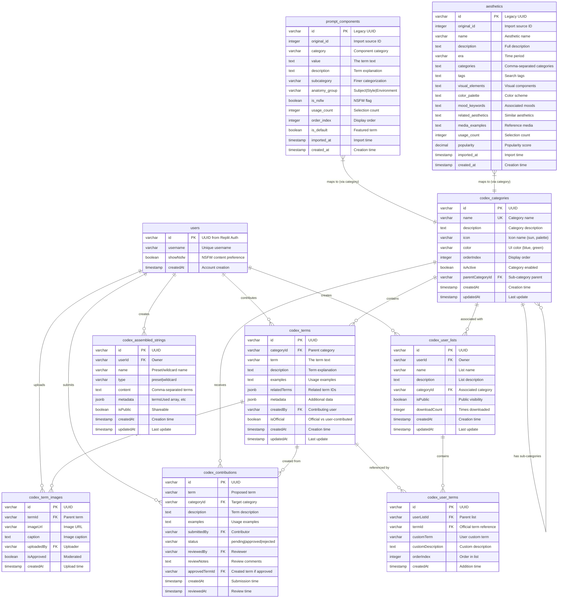

# PromptAtrium Wordsmith Codex - Complete Diagram Set

> **Purpose:** Complete architectural diagrams for Wordsmith Codex flow  
> **Created:** December 2024  
> **Contents:** C4 Component Diagram, Sequence Diagram, ER Diagram

---

## A. Architecture & Communication Map (C4 Component Diagram)

This C4 diagram shows how the Wordsmith Codex feature communicates between components.

```mermaid
C4Component
    title Wordsmith Codex - Component Architecture

    Container_Boundary(frontend, "Frontend (React)") {
        Component(codexPage, "Codex Page", "React Page", "Main codex interface with categories")
        Component(categoryBrowser, "Category Browser", "React Component", "Navigate term categories")
        Component(termGrid, "Term Grid", "React Component", "Display terms with selection")
        Component(searchBox, "Search Box", "React Component", "Full-text term search")
        Component(assemblyPanel, "Assembly Panel", "React Portal", "Floating collected terms panel")
        Component(presetManager, "Preset Manager", "React Component", "Save/load term presets")
        Component(localState, "Local State", "React useState", "Client-side term assembly")
        Component(queryClient, "TanStack Query", "State Manager", "Caches categories, terms, presets")
    }

    Container_Boundary(api, "API Gateway (Express)") {
        Component(categoryRoutes, "Category Routes", "Express Router", "/api/wordsmith-categories")
        Component(termRoutes, "Term Routes", "Express Router", "/api/wordsmith-terms")
        Component(searchRoute, "Search Route", "Express Router", "/api/wordsmith-terms?search=")
        Component(presetRoutes, "Preset Routes", "Express Router", "/api/codex-assembled-strings")
        Component(authMiddleware, "Auth Middleware", "Passport OIDC", "Validates user session")
    }

    Container_Boundary(storage, "Storage Layer") {
        Component(storageInterface, "IStorage Interface", "TypeScript Interface", "Database operations")
        Component(dbStorage, "DatabaseStorage", "Drizzle ORM", "PostgreSQL implementation")
    }

    Container_Boundary(database, "PostgreSQL Database") {
        ComponentDb(categoriesTable, "codex_categories", "Table", "Term categories")
        ComponentDb(termsTable, "codex_terms", "Table", "Individual terms")
        ComponentDb(componentsTable, "prompt_components", "Table", "Legacy components")
        ComponentDb(aestheticsTable, "aesthetics", "Table", "Legacy aesthetics")
        ComponentDb(userListsTable, "codex_user_lists", "Table", "User collections")
        ComponentDb(userTermsTable, "codex_user_terms", "Table", "Terms in collections")
        ComponentDb(assembledTable, "codex_assembled_strings", "Table", "Saved presets")
    }

    Rel(codexPage, categoryBrowser, "Uses")
    Rel(codexPage, termGrid, "Uses")
    Rel(codexPage, searchBox, "Uses")
    Rel(codexPage, assemblyPanel, "Uses")
    Rel(codexPage, presetManager, "Uses")
    
    Rel(categoryBrowser, queryClient, "Fetches via")
    Rel(termGrid, queryClient, "Fetches via")
    Rel(searchBox, queryClient, "Searches via")
    Rel(presetManager, queryClient, "CRUD via")
    
    Rel(termGrid, localState, "Updates")
    Rel(assemblyPanel, localState, "Reads/writes")
    
    Rel(queryClient, categoryRoutes, "HTTP GET", "JSON")
    Rel(queryClient, termRoutes, "HTTP GET", "JSON")
    Rel(queryClient, searchRoute, "HTTP GET", "JSON")
    Rel(queryClient, presetRoutes, "HTTP CRUD", "JSON")
    
    Rel(presetRoutes, authMiddleware, "Auth required")
    
    Rel(categoryRoutes, storageInterface, "Query")
    Rel(termRoutes, storageInterface, "Query")
    Rel(presetRoutes, storageInterface, "CRUD")
    
    Rel(storageInterface, dbStorage, "Implements")
    Rel(dbStorage, categoriesTable, "SELECT")
    Rel(dbStorage, termsTable, "SELECT")
    Rel(dbStorage, componentsTable, "SELECT UNION")
    Rel(dbStorage, aestheticsTable, "SELECT UNION")
    Rel(dbStorage, userListsTable, "CRUD")
    Rel(dbStorage, userTermsTable, "CRUD")
    Rel(dbStorage, assembledTable, "CRUD")

    UpdateLayoutConfig($c4ShapeInRow="3", $c4BoundaryInRow="2")
```



---

## B. State & Data Workflow (Sequence Diagram)

This sequence diagram shows the complete Codex workflow with state updates.

```mermaid
sequenceDiagram
    participant User as User
    participant UI as Codex UI
    participant State as Local State<br/>(useState)
    participant Query as TanStack Query<br/>(Cache)
    participant API as Express API
    participant Storage as DatabaseStorage
    participant DB as PostgreSQL

    Note over User,DB: === LOAD CODEX ===
    User->>UI: Navigate to Wordsmith Codex
    UI->>Query: useQuery(['/api/wordsmith-categories'])
    Query->>Query: Check cache
    alt Cache HIT
        Query-->>UI: Return cached categories
    else Cache MISS
        Query->>API: GET /api/wordsmith-categories
        API->>Storage: getWordsmithCategories()
        Storage->>DB: SELECT DISTINCT category,<br/>COUNT(*) as term_count<br/>FROM prompt_components<br/>GROUP BY category<br/>UNION<br/>SELECT DISTINCT category,<br/>COUNT(*)<br/>FROM aesthetics<br/>GROUP BY category
        DB-->>Storage: Category aggregates
        Storage->>Storage: Build anatomy groups<br/>(Subject, Style, Environment)
        Storage-->>API: [{id, name, termCount, anatomyGroup}]
        API-->>Query: 200 OK [categories]
        Query->>Query: Cache at ['/api/wordsmith-categories']
        Query-->>UI: Categories loaded
    end
    UI->>State: setSelectedCategory(null)
    UI-->>User: Display category list

    Note over User,DB: === BROWSE CATEGORY ===
    User->>UI: Click "Lighting" category
    UI->>State: setSelectedCategory("Lighting")
    UI->>Query: useQuery(['/api/wordsmith-terms', {category: "Lighting"}])
    Query->>Query: Check cache
    alt Cache HIT
        Query-->>UI: Return cached terms
    else Cache MISS
        Query->>API: GET /api/wordsmith-terms?category=Lighting&limit=50
        API->>Storage: getWordsmithTerms({category, limit, userId})
        Storage->>DB: SELECT * FROM prompt_components<br/>WHERE category = 'Lighting'<br/>AND (is_nsfw = false OR {userPref})<br/>ORDER BY usage_count DESC<br/>LIMIT 50
        DB-->>Storage: Term rows
        Storage-->>API: [{id, value, description, is_nsfw}]
        API-->>Query: 200 OK [terms]
        Query->>Query: Cache at query key
        Query-->>UI: Terms loaded
    end
    UI-->>User: Display term grid

    Note over User,DB: === SEARCH TERMS ===
    User->>UI: Type "dramatic" in search
    UI->>UI: Debounce input (300ms)
    UI->>Query: useQuery(['/api/wordsmith-terms', {search: "dramatic"}])
    Query->>API: GET /api/wordsmith-terms?search=dramatic&limit=50
    API->>Storage: getWordsmithTerms({search: "dramatic"})
    Storage->>DB: SELECT * FROM prompt_components<br/>WHERE value ILIKE '%dramatic%'<br/>OR description ILIKE '%dramatic%'<br/>UNION<br/>SELECT * FROM aesthetics<br/>WHERE name ILIKE '%dramatic%'<br/>OR tags ILIKE '%dramatic%'
    DB-->>Storage: Mixed results
    Storage-->>API: Combined search results
    API-->>Query: 200 OK [searchResults]
    Query-->>UI: Search results
    UI-->>User: Display search results

    Note over User,DB: === SELECT TERMS (CLIENT-SIDE) ===
    User->>UI: Click "Dramatic Lighting"
    UI->>State: assembledString.push("Dramatic Lighting")
    Note right of State: No API call!<br/>Pure client state
    State-->>UI: State updated
    UI-->>User: Term appears in assembly panel

    User->>UI: Click "Neon Colors"
    UI->>State: assembledString.push("Neon Colors")
    State-->>UI: State updated

    User->>UI: Click "Professional Photography"
    UI->>State: assembledString.push("Professional Photography")
    State-->>UI: State updated
    UI-->>User: Assembly panel shows:<br/>["Dramatic Lighting", "Neon Colors", "Professional Photography"]

    Note over User,DB: === RANDOMIZE (CLIENT-SIDE) ===
    User->>UI: Click "Randomize"
    UI->>State: Fisher-Yates shuffle(assembledString)
    Note right of State: ["Professional Photography",<br/>"Dramatic Lighting",<br/>"Neon Colors"]
    State-->>UI: Shuffled order
    UI-->>User: Terms reordered in panel

    Note over User,DB: === COPY TO CLIPBOARD ===
    User->>UI: Click "Copy"
    UI->>UI: assembledString.join(", ")
    UI->>UI: navigator.clipboard.writeText(text)
    UI-->>User: "Copied to clipboard" toast

    Note over User,DB: === SAVE AS PRESET ===
    User->>UI: Click Save → "Save as Preset"
    UI->>UI: Open save dialog
    User->>UI: Enter name "Cyberpunk Bundle"
    UI->>Query: useMutation POST /api/codex-assembled-strings
    Query->>API: POST /api/codex-assembled-strings<br/>{name: "Cyberpunk Bundle",<br/>type: "preset",<br/>content: "Dramatic Lighting, Neon Colors...",<br/>metadata: {termsUsed: [...]}}
    API->>API: Extract userId from session
    API->>Storage: createCodexAssembledString(data)
    Storage->>DB: INSERT INTO codex_assembled_strings<br/>(id, user_id, name, type, content, metadata)
    DB->>DB: Generate UUID, set timestamps
    DB-->>Storage: Created row
    Storage-->>API: CodexAssembledString
    API-->>Query: 201 Created {preset}
    Query->>Query: Invalidate ['/api/codex-assembled-strings']
    Query-->>UI: Save complete
    UI-->>User: "Preset saved!" toast

    Note over User,DB: === SEND TO QUICK PROMPTER ===
    User->>UI: Click "Send"
    UI->>UI: Build termsString = join(", ")
    UI->>UI: new URLSearchParams({subject: termsString})
    UI->>UI: navigate("/tools/quick-prompter?" + params)
    UI-->>User: Redirect to Quick Prompter<br/>with subject pre-filled

    Note over User,DB: === MANAGE PRESETS ===
    User->>UI: Go to "Saved Presets" tab
    UI->>Query: useQuery(['/api/codex-assembled-strings'])
    Query->>API: GET /api/codex-assembled-strings
    API->>API: Extract userId
    API->>Storage: getCodexAssembledStrings(userId)
    Storage->>DB: SELECT * FROM codex_assembled_strings<br/>WHERE user_id = ?<br/>ORDER BY created_at DESC
    DB-->>Storage: User's presets
    Storage-->>API: CodexAssembledString[]
    API-->>Query: 200 OK [presets]
    Query-->>UI: Presets loaded
    UI-->>User: Display saved presets

    User->>UI: Click "Load" on a preset
    UI->>State: setAssembledString(preset.termsUsed)
    State-->>UI: Preset loaded
    UI-->>User: Terms populated in assembly panel

    User->>UI: Click "Delete" on a preset
    UI->>Query: useMutation DELETE /api/codex-assembled-strings/:id
    Query->>API: DELETE /api/codex-assembled-strings/preset-123
    API->>Storage: deleteCodexAssembledString(id)
    Storage->>DB: DELETE FROM codex_assembled_strings<br/>WHERE id = ?
    DB-->>Storage: Deleted
    Storage-->>API: Success
    API-->>Query: 204 No Content
    Query->>Query: Invalidate ['/api/codex-assembled-strings']
    Query-->>UI: Deletion complete
    UI-->>User: Preset removed
```



---

## C. Data Schema (Entity Relationship Diagram)

This ERD shows the database tables and relationships for the Wordsmith Codex feature.



---

## Key Data Relationships

### Core Entities

| Entity | Primary Key | Description |
|--------|-------------|-------------|
| `codex_categories` | `id` (UUID) | Hierarchical category structure |
| `codex_terms` | `id` (UUID) | Official curated terms |
| `prompt_components` | `id` (UUID) | Legacy imported terms |
| `aesthetics` | `id` (UUID) | Legacy aesthetic references |
| `codex_assembled_strings` | `id` (UUID) | User-saved presets |

### Data Sources for Terms

The Codex pulls terms from multiple sources:

| Source | Table | Usage |
|--------|-------|-------|
| Official Terms | `codex_terms` | New curated content |
| Legacy Components | `prompt_components` | Imported data |
| Legacy Aesthetics | `aesthetics` | Style references |
| User Custom | `codex_user_terms.customTerm` | User additions |

### Search Query Structure

```sql
-- Combined search across all term sources
SELECT id, value as term, category, description, 'component' as source
FROM prompt_components
WHERE value ILIKE '%query%' OR description ILIKE '%query%'
  AND (is_nsfw = false OR user_allows_nsfw)

UNION ALL

SELECT id, name as term, category, description, 'aesthetic' as source
FROM aesthetics  
WHERE name ILIKE '%query%' OR tags ILIKE '%query%'

UNION ALL

SELECT id, term, category_id, description, 'official' as source
FROM codex_terms
WHERE term ILIKE '%query%' OR description ILIKE '%query%'

ORDER BY usage_count DESC
LIMIT 50
```

### Preset Storage Format

```json
{
  "id": "preset-123",
  "userId": "user-456",
  "name": "Cyberpunk Portrait Bundle",
  "type": "preset",
  "content": "Dramatic Lighting, Neon Colors, Professional Photography, Ultra Detailed",
  "metadata": {
    "termsUsed": [
      "Dramatic Lighting",
      "Neon Colors", 
      "Professional Photography",
      "Ultra Detailed"
    ],
    "categoryUsed": "mixed",
    "generatedAt": "2024-12-19T10:30:00Z"
  },
  "isPublic": false,
  "createdAt": "2024-12-19T10:30:00Z"
}
```

---

## Cache Invalidation Rules

| Action | Invalidate Keys |
|--------|-----------------|
| Load categories | `['/api/wordsmith-categories']` (cache 10 min) |
| Browse category | `['/api/wordsmith-terms', {category}]` (cache 5 min) |
| Search terms | No cache (fresh every time) |
| Select term | No invalidation (client state) |
| Save preset | `['/api/codex-assembled-strings']` |
| Delete preset | `['/api/codex-assembled-strings']` |
| Load preset | No invalidation (read only) |

---

## Client-Side State Management

### Assembly State (Not in Database)

```typescript
// Pure client-side state - no API calls during assembly
const [assembledString, setAssembledString] = useState<string[]>([]);

// Add term (O(1))
const addTerm = (term: string) => {
  setAssembledString(prev => [...prev, term]);
};

// Remove term (O(n))
const removeTerm = (index: number) => {
  setAssembledString(prev => prev.filter((_, i) => i !== index));
};

// Randomize (O(n))
const randomize = () => {
  setAssembledString(prev => {
    const shuffled = [...prev];
    for (let i = shuffled.length - 1; i > 0; i--) {
      const j = Math.floor(Math.random() * (i + 1));
      [shuffled[i], shuffled[j]] = [shuffled[j], shuffled[i]];
    }
    return shuffled;
  });
};

// Clear all
const clear = () => setAssembledString([]);
```

### Important: No Server Round-Trips for Selection

The term selection/assembly is 100% client-side until the user explicitly saves. This ensures:
- Instant response to user clicks
- No network latency during assembly
- Offline-capable term selection
- Reduced server load

---

This complete diagram set provides full visibility into the Wordsmith Codex architecture for redesign planning.
